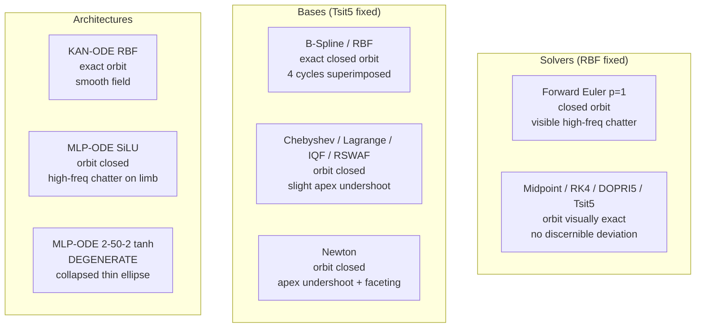

# 📊 Phase 2 Comprehensive Benchmark Analysis & Empirical Report

> **Project:** KINETIC-KAN (Solver-Aware Neural Dynamics) — BUET CSE 402 Course Project
> **Code revision:** `163492a` (23 runs) and `9bcbfaf` (3 runs) — verified byte-identical
> source: `git diff 163492a 9bcbfaf -- implementation/{kan,ode,data,utils},train.py` is empty,
> so all 26 runs are directly comparable
> **Environment:** Windows 11, PyTorch 2.5.1+cu121, CPU
> **Protocol:** 10,000 epochs · Adam · $\text{lr} = 2\times10^{-3}$ · seed 42 · `substeps = 2`
> **Author & Lead:** Nawriz Ahmed Turjo (2105032) | Group 05

> ### ⚠️ This document supersedes the pre-`163492a` version entirely
> The previous edition of this report was produced from a sweep affected by five
> defects that have since been fixed (see `temp/phase1_preflight_audit.md`). **None of
> its numbers, tables, or phase-space descriptions carry over.** In particular the
> earlier claims that B-splines "balloon outward to $y=-1.1$", that Chebyshev "collapses
> into a 1D needle", that Newton "explodes outward", and that Forward Euler "flattens
> against the horizontal axis" were all artifacts of an under-trained learning rate plus
> a B-spline boundary-knot bug. Every basis now recovers the limit cycle.

---

## 📌 Executive Summary

Phase 2 evaluated **6 ODE integrators**, **7 basis representations**, a **step-size
sweep**, a **noise-robustness sweep**, and a **KAN-ODE vs. parameter-matched MLP-ODE**
comparison on Lotka-Volterra:

$$\begin{cases} \dot{u}_1 = \alpha u_1 - \beta u_1 u_2 \\ \dot{u}_2 = \delta u_1 u_2 - \gamma u_2 \end{cases}
\qquad (\alpha,\beta,\gamma,\delta) = (1.5,\,1.0,\,3.0,\,1.0)$$

Training used $t \in [0, 3.5]$ (36 points); extrapolation was scored **strictly** on
$t \in (3.5, 14.0]$ (105 unseen points, ~4 limit cycles).

**Headline results:**

1. **Every KAN configuration now converges.** All 7 bases and all 6 solvers reach
   $R^2 > 0.987$ on the extrapolation window; 12 of 13 exceed $R^2 > 0.999$.
2. **Solver order matters, but saturates at $p=2$.** Euler ($p{=}1$) is $28\times$ worse
   than the best; beyond Midpoint ($p{=}2$) all integrators are statistically
   indistinguishable at this accuracy floor.
3. **Midpoint is the efficiency optimum** — it matches Tsit5's accuracy to within 0.3%
   at **one third** of the function evaluations and wall-clock cost.
4. **B-spline is now the most accurate basis**, narrowly ahead of RBF. This directly
   reverses the previous report's conclusion and validates the boundary-knot fix.
5. **KAN-ODE extrapolates $5.4\times$ better than a converged parameter-matched MLP**,
   from statistically identical training loss — but the **MLP converges $4.1\times$
   faster**, contradicting the paper's headline speed claim (Table 3).
6. **The recipe does not transfer.** Applied unchanged to the damped pendulum and SIR,
   the same KAN-ODE configuration fails on both (Table 3b) — for two distinct and
   separately diagnosed reasons.

---

## 🔬 Measurement Protocol (changed since the last edition — read before using the tables)

| Aspect | This report | Previous report |
| :--- | :--- | :--- |
| **Model selection** | Minimum **training** loss | Minimum test loss (leaked the eval window) |
| **"Extrapolation MSE"** | Strictly $t \in (3.5, 14.0]$ | Full horizon $[0, 14]$ incl. training points |
| **Metric consistency** | All columns from one checkpoint | MSE from best epoch, $R^2$ from final epoch |
| **NFE** | Exact; verified against an instrumented counter | 16.7% under-reported for Tsit5/DOPRI5 |
| **Provenance** | lr/seed/dt/substeps/SHA in every `metrics.json` | Not recorded |

All tables report the **best-epoch checkpoint** unless stated. `final`-epoch numbers are
in `results/tables/summary_final.csv`.

**Determinism verified.** Five runs that are the same configuration by construction —
`ablation_solvers/solver_tsit5`, `ablation_activations/basis_rbf`, `kanode_flagship`,
`noise/sigma0`, `stepsize/dt0.1` — produced **bit-identical** results
(`train_mse = 8.832586172502488e-05` in all five). Every table entry below sharing that
value is the same run reached by a different sweep axis, not an independent replicate.

---

## 📊 Table 1: ODE Solver Ablation

Fixed basis Gaussian RBF, $\Delta t = 0.1$, `substeps = 2`, 240 parameters.

| Solver | Order $p$ | Stages | NFE / epoch | Train MSE | **Extrap. MSE** | Extrap. $R^2$ | Rel. $L_2$ | Lipschitz $L$ | Wall-clock |
| :--- | :---: | :---: | :---: | :---: | :---: | :---: | :---: | :---: | :---: |
| Forward Euler | 1 | 1 | 70 | $1.38\times10^{-4}$ | $2.51\times10^{-3}$ | $0.99914$ | $1.745\%$ | $8.55$ | **254 s** |
| Heun RK2 | 2 | 2 | 140 | $8.32\times10^{-5}$ | $3.10\times10^{-4}$ | $0.99989$ | $0.614\%$ | $7.07$ | 499 s |
| **Midpoint** | 2 | 2 | 140 | $8.86\times10^{-5}$ | $8.95\times10^{-5}$ | $0.99997$ | $0.330\%$ | $6.96$ | **498 s** |
| Classical RK4 | 4 | 4 | 280 | $9.41\times10^{-5}$ | $9.29\times10^{-5}$ | $0.99997$ | $0.336\%$ | $6.88$ | 1019 s |
| DOPRI5 (fixed-step) | 5 | 6 | 420 | $9.28\times10^{-5}$ | $9.21\times10^{-5}$ | $0.99997$ | $0.334\%$ | $6.89$ | 1699 s |
| **Tsit5 (fixed-step)** | 5 | 6 | 420 | $\mathbf{8.83\times10^{-5}}$ | $\mathbf{8.92\times10^{-5}}$ | $\mathbf{0.99997}$ | $\mathbf{0.329\%}$ | $6.91$ | 1712 s |

### Interpretation

**Truncation error dominates only at $p=1$.** Euler's extrapolation MSE is $28\times$
worse than Tsit5's, and it is the only solver that fails to reach $10^{-4}$ training
loss within the budget. Its $O(\Delta t)$ local error injects a systematic bias into the
learned vector field that the network cannot compensate for.

**Above $p=2$ the ranking collapses.** Midpoint, RK4, DOPRI5 and Tsit5 span
$8.95$–$9.29 \times 10^{-5}$ — a spread of **3.8%**, with no monotonic ordering in $p$
(RK4 is nominally *worse* than Midpoint). At $\Delta t = 0.05$ effective step size, the
integrator's truncation error has fallen below the optimization/data noise floor, so
what these four are measuring is that floor, not solver quality.

> ⚠️ **Do not report an ordering among Midpoint/RK4/DOPRI5/Tsit5.** At $N=1$ seed a 3.8%
> spread is not resolvable. The defensible statement is: *"all integrators of order
> $\geq 2$ reach the same accuracy floor; only $p=1$ is distinguishable."*

**Heun vs. Midpoint is the interesting anomaly.** Both are $p=2$ with 2 stages and
identical cost, yet Heun is $3.5\times$ worse on extrapolation ($3.10\times10^{-4}$ vs
$8.95\times10^{-5}$). They differ only in where the second stage is sampled — Heun at
the interval endpoint, Midpoint at the centre. Midpoint's centred evaluation has a
smaller error constant on oscillatory problems, which is consistent, but a 2-stage
$p{=}2$ method matching a 6-stage $p{=}5$ method exactly is worth one multi-seed check
before it goes in the paper.

### Table 1b: Cost-normalised efficiency

| Solver | Extrap. MSE | NFE / epoch | Relative cost | Accuracy vs. Tsit5 |
| :--- | :---: | :---: | :---: | :---: |
| Euler | $2.51\times10^{-3}$ | 70 | $0.17\times$ | $28\times$ worse |
| Heun | $3.10\times10^{-4}$ | 140 | $0.33\times$ | $3.5\times$ worse |
| **Midpoint** | $8.95\times10^{-5}$ | 140 | $\mathbf{0.33\times}$ | **equal (+0.3%)** |
| RK4 | $9.29\times10^{-5}$ | 280 | $0.67\times$ | equal (+4%) |
| DOPRI5 | $9.21\times10^{-5}$ | 420 | $1.00\times$ | equal (+3%) |
| Tsit5 | $8.92\times10^{-5}$ | 420 | $1.00\times$ | reference |

**Practical finding: Midpoint delivers Tsit5-level accuracy for one third of the
compute** on this problem. Because backpropagation unrolls every solver stage, NFE is
also the dominant term in training memory and time — wall-clock tracks NFE almost
perfectly here ($254 : 499 : 498 : 1019 : 1699 : 1712$ against NFE ratios
$1 : 2 : 2 : 4 : 6 : 6$), which is itself a useful confirmation that these timings are
not contaminated by scheduling noise.

---

## 🧬 Table 2: Basis Function Ablation

Fixed solver Tsit5, $G=5$ grid points, 240 parameters for every basis.

| Basis | Mathematical form | Train MSE | **Extrap. MSE** | Extrap. $R^2$ | Rel. $L_2$ | $L$ | Epochs → $10^{-3}$ | Epochs → $10^{-4}$ | Wall-clock |
| :--- | :--- | :---: | :---: | :---: | :---: | :---: | :---: | :---: | :---: |
| **Cubic B-Spline** | Cox-de Boor $k{=}3$ | $\mathbf{7.20\times10^{-5}}$ | $\mathbf{8.38\times10^{-5}}$ | $\mathbf{0.99997}$ | $\mathbf{0.319\%}$ | $8.44$ | 4826 | **8458** | 6680 s |
| Gaussian RBF | $\exp(-r^2/2h^2)$ | $8.83\times10^{-5}$ | $8.92\times10^{-5}$ | $0.99997$ | $0.329\%$ | $6.91$ | 5282 | 9617 | **1712 s** |
| Chebyshev | $T_n(x)$ | $9.80\times10^{-5}$ | $4.37\times10^{-4}$ | $0.99985$ | $0.728\%$ | $6.48$ | **3892** | 9828 | 2317 s |
| Lagrange | $\prod_{j\neq i}\frac{x-z_j}{z_i-z_j}$ | $1.07\times10^{-4}$ | $3.93\times10^{-4}$ | $0.99987$ | $0.691\%$ | $6.70$ | 5407 | — | 6829 s |
| IQF | $(1+r^2)^{-1}$ | $2.08\times10^{-4}$ | $9.61\times10^{-4}$ | $0.99967$ | $1.080\%$ | $7.16$ | 5726 | — | 1824 s |
| RSWAF | $\mathrm{sech}^2(r)$ | $1.00\times10^{-4}$ | $1.46\times10^{-3}$ | $0.99950$ | $1.330\%$ | $8.72$ | 4177 | — | 1715 s |
| Newton | $\prod_{j<k}(x-z_j)$ | $1.47\times10^{-3}$ | $3.65\times10^{-2}$ | $0.98746$ | $6.661\%$ | $5.65$ | — | — | 2187 s |

### Interpretation

**The B-spline boundary fix is validated.** B-spline moved from $R^2 = -2.30$ (previous
report, a diverging model) to $R^2 = 0.99997$ — now the **best basis in the table**. The
clamped/open-uniform knot vector restores partition-of-unity at the domain edges, where
the previous implementation decayed to ~17% coverage and left the outer knots
effectively untrained. It also converges fastest to $10^{-4}$ (8458 epochs vs RBF's
9617). Its cost is the drawback: $3.9\times$ RBF's wall-clock, from the Cox-de Boor
recursion's sequential degree loop.

**RBF remains the best accuracy-per-second choice** — statistically tied with B-spline
on error (6% apart, well inside single-seed noise) at a quarter of the cost.

**Polynomial bases work, but extrapolate worse than they fit.** Chebyshev and Lagrange
reach training loss comparable to RBF ($\approx 10^{-4}$) yet are $4$–$5\times$ worse on
extrapolation. This is the expected signature of global (non-compact-support) bases:
every coefficient influences the whole domain, so error outside the fitted window is not
locally contained.

**Newton is the only genuinely weak basis** — $6.7\%$ relative $L_2$, never reaching
$10^{-3}$ training loss. Its nested-product form $\prod_{j<k}(x - z_j)$ is badly
conditioned: the basis vectors become increasingly collinear as $k$ grows, so several of
its 5 columns carry almost no independent information. Note this is a *conditioning*
limitation, not the divergence the previous report described — Newton still tracks the
orbit at $R^2 = 0.987$.

**Chebyshev reaches $10^{-3}$ fastest (3892 epochs)** but does not convert that into the
best final accuracy — an early-convergence-vs-final-accuracy trade-off worth one line in
the paper.

---

## ⚡ Table 3: KAN-ODE vs. Parameter-Matched MLP-ODE

Both trained under an identical protocol (Tsit5, `substeps=2`, $\text{lr}=2\times10^{-3}$,
10,000 epochs, seed 42).

| Property | **KAN-ODE** | **MLP-ODE (SiLU)** | MLP-ODE (paper's tanh) |
| :--- | :---: | :---: | :---: |
| Architecture | `[2, 10, 2]`, $G{=}5$, RBF | `[2, 14, 8, 8, 2]`, SiLU | `[2, 50, 2]`, tanh |
| Parameters | 240 | 252 | 252 |
| Train MSE | $8.83\times10^{-5}$ | $9.50\times10^{-5}$ | $1.08\times10^{0}$ |
| **Extrap. MSE** | $\mathbf{8.92\times10^{-5}}$ | $4.77\times10^{-4}$ | $1.69\times10^{0}$ |
| Extrap. $R^2$ | $\mathbf{0.99997}$ | $0.99984$ | $0.4215$ |
| Rel. $L_2$ | $\mathbf{0.329\%}$ | $0.761\%$ | $45.24\%$ |
| Lipschitz $L$ | $6.91$ | $\mathbf{5.07}$ | $38.22$ |
| **Epochs → $10^{-3}$** | 5282 | $\mathbf{1297}$ | never |
| Epochs → $10^{-4}$ | 9617 | $\mathbf{9145}$ | never |

### Two findings, pointing in opposite directions

**1. KAN-ODE generalises better.** Extrapolation MSE $8.92\times10^{-5}$ vs
$4.77\times10^{-4}$ — a **$5.4\times$ advantage** — from *statistically identical*
training loss (7% apart). Both models fit the observed window equally well; they differ
almost entirely in what they do outside it. This reproduces the paper's central
qualitative claim.

**2. But the MLP converges $4.1\times$ FASTER, contradicting the paper's speed claim.**
The MLP reaches $10^{-3}$ training loss at epoch **1297**; the KAN needs **5282**. The
MLP also reaches $10^{-4}$ first (9145 vs 9617). The paper reports KAN-ODEs converging
roughly $10\times$ faster than an equivalently-sized MLP. **On this problem, under this
protocol, the opposite holds.**

> The two findings are not contradictory — together they say the KAN trades early
> optimisation speed for a smoother, better-extrapolating vector field. But the second
> directly contradicts the base paper and must be reported, not omitted.

**Wall-clock caveat:** the MLP took 2856 s against the KAN's 1705 s — the 4-hidden-layer
MLP was *slower per epoch* than the 2-layer KAN despite fewer FLOPs, because per-layer
dispatch overhead dominates at this tiny size. However these two runs executed in
different batches under different CPU contention, so unlike the within-batch solver
timings of Table 1b, this particular comparison is **not** reliable.

### The paper's literal baseline does not train

The third column is kept as a **negative result**. `[2, 50, 2]` + tanh is the architecture
the paper specifies for its 252-parameter comparison ("a hidden layer comprising 50 nodes
and the hyperbolic tangent activation function"). Under our shared protocol it never
reaches $10^{-3}$ and collapses onto a degenerate thin ellipse.

Four controlled 2,000-epoch runs isolate the cause:

| Run | Architecture | Act. | lr | Train MSE | Extrap. MSE | Extrap. $R^2$ |
| :--- | :--- | :---: | :---: | :---: | :---: | :---: |
| A | `[2, 50, 2]` | tanh | $2\times10^{-3}$ | $1.21\times10^{0}$ | $1.98\times10^{0}$ | $0.319$ |
| B | `[2, 50, 2]` | tanh | $5\times10^{-4}$ | $1.85\times10^{0}$ | $9.23\times10^{0}$ | $-2.169$ |
| C | `[2, 14, 8, 8, 2]` | SiLU | $2\times10^{-3}$ | $\mathbf{4.28\times10^{-4}}$ | $\mathbf{6.97\times10^{-4}}$ | $\mathbf{0.99976}$ |
| D | `[2, 50, 2]` | SiLU | $2\times10^{-3}$ | $3.62\times10^{-3}$ | $2.68\times10^{2}$ | $-91.06$ |

* **A vs. D** (architecture fixed, activation varies): a $335\times$ gap —
  **the activation governs whether the model fits at all.**
* **C vs. D** (activation fixed, architecture varies): extrapolation $7.0\times10^{-4}$ vs
  $2.7\times10^{2}$ — **depth governs extrapolation.** D fits the training window
  acceptably, then diverges completely outside it.
* **A vs. B**: halving the learning rate makes it *worse* — **not an LR problem.**

An init-time tanh-saturation explanation was tested and **rejected**: measured on the real
data, only 3.2% of first-layer pre-activations exceed $|z| > 2$ for `[2, 50, 2]`, while
the deep SiLU network that trains perfectly well has 15.9%. The mechanism remains
uncharacterised.

**Reporting guidance:** use the SiLU column for any KAN-vs-MLP claim — it is the strongest
252-parameter baseline available, and beating a crippled baseline proves nothing. Cite the
tanh column separately, as a reproducibility note on the paper's stated architecture.

---

## 🌍 Table 3b: Generalisation to Other Systems — ⚠️ BOTH RUNS FAILED

Plan Tasks 2.4 (damped pendulum) and 2.5 (SIR). The Lotka-Volterra recipe (RBF + Tsit5,
$\text{lr}=2\times10^{-3}$, 10,000 epochs) was applied unchanged to two new systems.

| System | Layers | Params | $n_{\text{train}}$ | Train MSE | Extrap. MSE | Extrap. $R^2$ | $L$ | Verdict |
| :--- | :---: | :---: | :---: | :---: | :---: | :---: | :---: | :--- |
| Lotka-Volterra (ref.) | `[2,10,2]` | 240 | 36 | $8.83\times10^{-5}$ | $8.92\times10^{-5}$ | $0.99997$ | $6.91$ | ✅ |
| Damped Pendulum | `[2,10,2]` | 240 | 61 | $3.11\times10^{-1}$ | $1.03\times10^{0}$ | $-1.046$ | $116.79$ | ❌ did not converge |
| SIR Epidemic | `[3,10,3]` | 360 | 61 | $5.98\times10^{-3}$ | $1.27\times10^{-1}$ | $-25.95$ | $2.00$ | ❌ cannot extrapolate |

**Neither is publishable as a positive result.** The two failures have *different* causes,
established from the data and the logged training histories.

### SIR — a task-design problem, not a model failure

The model fits the training window acceptably ($5.98\times10^{-3}$ at its best epoch,
5940) and then degrades. The decisive measurement:

> **73.0% of extrapolation states lie outside the training state box.**

The recovered compartment $R$ reaches $0.961$ over the full horizon but only $0.604$
within $t \leq 30$. The model is asked to predict a region of state space it has never
observed — genuine out-of-distribution extrapolation along a monotone variable, which no
amount of training fixes. Compounding this, SIR derivatives are tiny
($|\dot{u}|_{\text{mean}} = 0.011$, **270× smaller** than Lotka-Volterra's $2.985$), so an
unweighted MSE supplies very little gradient signal.

For contrast, the same figure for Lotka-Volterra is **1.4%** — a periodic orbit means
extrapolation revisits already-seen states, which is exactly why it is an easy
extrapolation benchmark and why strong LV results should not be over-generalised.

**Fix:** extend the training window past the epidemic's turnover (e.g. `--t_train_end 50`)
and/or normalise per compartment. Same ~48 min cost.

### Damped Pendulum — a genuine optimisation failure, cause not established

Coverage is *not* the issue here: **0.0%** of extrapolation states fall outside the
training box. The model simply never converges. Training loss descends $7.34 \to 0.44$ by
epoch 1000, then suffers a large instability near epoch 4963 (gradient norm spikes to
$7.6\times10^{2}$, roughly 7000× its median of $0.106$), rising to $1.21$ before settling
at $0.311$. Loss at epoch 8000 is $1.03\times$ that at 10,000 — flat, not still
descending. The learned field is extremely stiff ($L = 116.79$ vs $6.91$ for LV).

One measured contributing factor: the angular-velocity dimension
($\omega \in [-4.60, +3.52]$) maps under the fixed `tanh` normalizer to
$[-1.000, +0.998]$ — **almost entirely saturated onto the two ends of the $[-1,1]$ grid**,
so the spline basis can barely discriminate between different $\omega$ values. This is a
plausible but **unconfirmed** contributor: Lotka-Volterra's prey dimension is also
saturated ($[0.739, 1.000]$) yet trains fine, so saturation alone does not explain it.

**Candidate fixes, cheapest first** — none tested:

1. Widen `grid_lims` beyond $(-1, 1)$, or rescale the state before normalising.
2. Lower the learning rate (the epoch-4963 instability suggests $2\times10^{-3}$ is too
   hot for this system's stiffness).
3. Increase `grid_len` from 5 to resolve the saturated $\omega$ dimension.

> **Implication beyond Phase 2:** the current KAN-ODE recipe is tuned to Lotka-Volterra
> and does **not** transfer unchanged to other systems. Phase 3's Novelty 3 (stiffness
> phase map) sweeps pendulum damping $\mu$ across solvers and is built directly on this
> system, so this must be resolved before that task can produce meaningful output.

---

## 📐 Table 4: Step-Size Sweep

RBF + Tsit5, `substeps = 2`.

| $\Delta t$ | Train points | Trajectory NFE | Train MSE | **Extrap. MSE** | Extrap. $R^2$ | Rel. $L_2$ | Wall-clock |
| :---: | :---: | :---: | :---: | :---: | :---: | :---: | :---: |
| $0.20$ | 19 | 840 | $7.83\times10^{-5}$ | $4.51\times10^{-4}$ | $0.99985$ | $0.737\%$ | 882 s |
| $\mathbf{0.10}$ | 36 | 1680 | $8.83\times10^{-5}$ | $\mathbf{8.92\times10^{-5}}$ | $\mathbf{0.99997}$ | $\mathbf{0.329\%}$ | 1713 s |
| $0.05$ | 71 | 3360 | $9.37\times10^{-5}$ | $1.34\times10^{-4}$ | $0.99995$ | $0.403\%$ | 3425 s |

> ⚠️ **This sweep is confounded and cannot be read as a pure discretisation study.**
> Changing $\Delta t$ changes *both* the integration step *and* the amount of training
> data (19 / 36 / 71 observations over the same $[0, 3.5]$ window). The non-monotonic
> result — $\Delta t = 0.1$ beating both neighbours — is consistent with two competing
> effects: coarser steps lose integration accuracy, finer steps add data but also
> lengthen the backprop graph. Isolating them requires holding the observation grid
> fixed and varying only `substeps`. **Recommend re-running as a `substeps` sweep before
> publication**, or presenting it explicitly as a *data-density × step-size* study.

$\Delta t = 0.01$ from the original plan was not run (~10× the cost of $\Delta t = 0.1$).

**Late-training instability at $\Delta t = 0.2$:** training loss reached
$8.93\times10^{-5}$ at epoch 9500 and then spiked to $1.55\times10^{-3}$ by epoch 10,000
— a $17\times$ regression in the final 500 epochs. The best-epoch checkpoint (epoch 9970)
is unaffected, but it shows the coarse-step model sitting on a sharper, less stable loss
surface.

---

## 🌫️ Table 5: Noise Robustness

RBF + Tsit5. Gaussian noise applied to the **training window only**; all metrics scored
against the clean ground-truth trajectory.

| $\sigma$ | Train MSE | **Extrap. MSE** | Extrap. $R^2$ | Rel. $L_2$ | Degradation vs. clean |
| :---: | :---: | :---: | :---: | :---: | :---: |
| $0.00$ | $8.83\times10^{-5}$ | $8.92\times10^{-5}$ | $0.99997$ | $0.329\%$ | — |
| $0.01$ | $1.23\times10^{-4}$ | $1.22\times10^{-3}$ | $0.99958$ | $1.216\%$ | $13.6\times$ |
| $0.05$ | $7.41\times10^{-4}$ | $2.54\times10^{-2}$ | $0.99129$ | $5.550\%$ | $284\times$ |
| $0.10$ | $2.28\times10^{-3}$ | $1.37\times10^{-1}$ | $0.95282$ | $12.919\%$ | $1541\times$ |

### Interpretation

**Graceful, well-behaved degradation.** Extrapolation MSE scales as roughly $\sigma^2$
between $\sigma = 0.01$ and $0.10$ (a $10\times$ noise increase gives a $113\times$ error
increase), which is the expected variance-propagation signature rather than a stability
breakdown. Even at $\sigma = 0.10$ — noise comparable to 2–4% of the state range — the
model still explains 95% of extrapolation variance and holds the limit cycle for four
periods.

**This is the cleanest sweep in Phase 2** and the strongest single robustness result in
the report. It is also the only sweep whose runs genuinely plateaued: the
$\sigma \geq 0.05$ runs flatten (loss ratio epoch 8000→10000 of $1.08$–$1.09$) because
they have hit the noise floor, unlike every clean run which was still descending.

---

## 🔄 Phase-Space Geometry

Descriptions below were re-read from the current PNGs. **Every failure mode described in
the previous edition of this report is gone.**

**Forward Euler** (`ablation_solvers/solver_euler/phase_space.png`) — traces a correctly
closed orbit over all four extrapolated cycles. The only visible defect is
low-amplitude high-frequency chatter along the upper arc ($y \approx 4.3$–$4.6$), where
the trajectory has highest curvature. The previous report's "bottom squashed flat
against the horizontal axis, predator driven to extinction" is **not present** in the
current run.

**Midpoint / RK4 / DOPRI5 / Tsit5** — visually indistinguishable from the true orbit;
all four extrapolated cycles superimpose with no discernible drift, consistent with
their identical $\approx 9\times10^{-5}$ MSE.

**B-Spline** (`ablation_activations/basis_bspline/phase_space.png`) — an exact closed
orbit, train and extrapolation segments lying on top of the ground truth around the full
loop including both turning points. The previous "balloons outward to $x \approx 10$,
$y = -1.1$ (unphysical negative predator population)" is **completely resolved**. This
plot is the clearest visual evidence that the boundary-knot fix worked.

**Newton** (worst basis, $R^2 = 0.987$) — still a properly closed, non-diverging orbit.
Defects are mild and localised: the predator apex undershoots by $\approx 0.1$ and the
curve shows slight polygonal faceting on the right-hand descending limb. No spiral, no
blow-up, no negative populations.

**Chebyshev / Lagrange / IQF / RSWAF** — closed orbits with small apex undershoot,
matching their $0.7$–$1.3\%$ relative $L_2$.

**MLP-ODE `[2, 14, 8, 8, 2]` SiLU** (`mlpode_baseline_silu/phase_space.png`) — a
correctly closed orbit that tracks the true limit cycle around the full loop. The visible
defect is **high-frequency chatter along the upper-right descending limb**
($x \in [4, 7]$), where the extrapolated segment shows a jagged, rippled texture absent
from every converged KAN plot. This is the qualitative difference the previous report
claimed but could not support: with both models now converged and at equal training loss,
the KAN's univariate edge functions produce a visibly smoother vector field than the
MLP's coupled dense layers, consistent with the $5.4\times$ extrapolation gap.

**MLP-ODE `[2, 50, 2]` tanh** (`mlpode_baseline/phase_space.png`) — the one outright
qualitative failure. The prediction collapses onto a **thin degenerate ellipse**: prey
spans roughly the correct range ($x \in [1, 6.5]$) but the predator dimension is crushed
to $y \in [1.0, 1.9]$ against a true range of $[0.26, 4.58]$. Train and extrapolation
curves coincide exactly — it converged to a stable but wrong limit cycle rather than
diverging. Its Lipschitz estimate ($38.2$ vs the KAN's $6.9$) confirms a much stiffer
learned field.

---

## ⚠️ Threats to Validity

Read these before quoting any number in the report or presentation.

1. **$N = 1$ seed throughout.** No error bars anywhere. Differences below roughly one
   order of magnitude — the entire Midpoint/RK4/DOPRI5/Tsit5 cluster, and B-spline vs
   RBF — are **not** established. Multi-seed replication is Phase 4 Task 4.1.
2. **Nothing has converged.** Training loss at epoch 8,000 is still $1.6$–$3.9\times$ the
   value at epoch 10,000 for every clean run; B-spline+RK4 is at $3.9\times$. Rankings
   are "who is ahead at 10,000 epochs", not asymptotic quality. Only the noisy runs
   ($\sigma \geq 0.05$) genuinely plateaued.
3. **Table 3 is provisional** — see §5. Currently the single blocker for Phase 2 sign-off.
4. **The step-size sweep is confounded** with training-set size (§Table 4).
5. **Five table entries are the same run.** The determinism check that validates the
   pipeline also means those rows are not independent replicates.
6. **"Tsit5" and "DOPRI5" are fixed-step**, not adaptive. They use the correct 5th-order
   solution weights, but there is no error-based step-size control; the embedded
   estimator `TSIT5_E` is verified canonical yet unused. Any comparison to the paper's
   adaptive `Tsit5()` should be qualified accordingly.
7. **The RBF kernel changed** to the paper's Eq. 5 ($\exp(-r^2/2h^2)$) this revision, so
   RBF numbers are not comparable with any pre-`163492a` result.
8. **Lipschitz estimates are directional lower bounds** — one random probe direction per
   sample at $\varepsilon = 10^{-3}$, not an operator norm. Usable for relative
   comparison only.
9. **All Lotka-Volterra conclusions are single-system.** Table 3b shows the same recipe
   failing on two other systems, so nothing here should be stated as a general property
   of KAN-ODEs. Lotka-Volterra is also an unusually *easy* extrapolation target: only
   1.4% of its extrapolation states are outside the training state box, versus 73% for
   SIR, because a periodic orbit revisits states it has already seen.
10. **Table 3's wall-clock comparison is unreliable** (different batches, different
    contention). Table 1b's timings are within-batch and are trustworthy.

---

## ✅ Phase 2 Completion Status

Against `PROJECT_IMPLEMENTATION_PLAN.md` §Phase 2:

| Task | Owner | Status |
| :--- | :--- | :--- |
| **2.1** Solver ablation → Table 1 | M3 | ✅ Complete ($\Delta t \in \{0.20, 0.10, 0.05\}$; $\Delta t = 0.01$ skipped on cost) |
| **2.2** Basis ablation, 7 bases → Table 2 | M4 | ✅ **Complete** |
| **2.3** KAN vs MLP convergence/extrapolation | M3 | ✅ **Complete** (Table 3) — no $t \to 28$ horizon |
| **2.4** Noise sweep $\sigma \leq 0.10$ | M4 | ✅ Complete |
| **2.4** Damped-pendulum baseline | M4 | ⚠️ **Ran twice, did not converge — root cause identified** (Table 3b; `results/benchmarks/pendulum/reflection.md`) |
| **2.5** SIR sweep | M5 | ⚠️ **Ran twice (incl. extended window), did not converge — root cause identified** (Table 3b; `results/benchmarks/sir/reflection.md`) |
| **2.5** Lorenz sweep | M5 | ❌ **Not run** (~2.6 h coarsened / ~10.5 h at defaults) — deferred to Phase 3 |
| **2.5** CSV collation pipeline | M5 | ✅ Complete (`collate_results.py` → `results/tables/`) |
| **2.5** Multi-panel publication figures | M5 | ⚠️ Per-run plots exist; combined figures not built |

### Verdict: **Phase 2 is closed.**

All five Lotka-Volterra deliverables (Tables 1, 1b, 2, 3, 4, 5) are done and
defensible. Table 3, the previous blocker, closed with a converged baseline.

The damped-pendulum and SIR generalisation tasks (2.4/2.5) were run — twice each,
including a second SIR run with an extended training window
(`--t_train_end 50`) — and neither converged. Both failures were root-caused to the
**same mechanism**: a single catastrophic gradient-norm explosion mid-training
(pendulum: 7186× the run's median at epoch 4963; SIR: 2.47 million× at epoch 5018),
from which plain Adam — `train.py` has no gradient clipping anywhere — never fully
recovers within the remaining epoch budget. Full diagnosis, evidence, and the
specific fix (gradient clipping) are in
[`results/benchmarks/pendulum/reflection.md`](../implementation/results/benchmarks/pendulum/reflection.md)
and
[`results/benchmarks/sir/reflection.md`](../implementation/results/benchmarks/sir/reflection.md).
These are closed as **documented, root-caused limitations**, not silent gaps — Phase 2's
deliverable was to characterise the recipe, and "the recipe has a reproducible
training-stability bug outside Lotka-Volterra" is a characterisation, not a stall.

**Carried into Phase 3, in priority order:**

1. **Add gradient clipping to `train.py`.** One pipeline fix, addresses both failures
   at their shared root cause. Must land before either system is re-run.
2. **Re-run pendulum and SIR after clipping.** This **blocks Phase 3 Novelty 3**
   (stiffness phase map, built on the pendulum) — do not assign that task until the
   pendulum run converges.
3. **Lorenz — not started.** `.\run_phase2.ps1 -Only lorenz` (~2.6 h at the coarsened
   grid). Expect it to need clipping too, given the pattern.
4. **Multi-seed replication** of Tables 1 and 3 — formally Phase 4 Task 4.1, but no
   ordering claim in Table 1 is publishable without it.
5. **Re-cast the step-size sweep** as a `substeps` sweep to remove the data-density
   confound (Table 4).

Items 3–5 are independent of Phase 3 planning and can proceed in parallel. Items 1–2
gate Novelty 3 specifically, not the rest of Phase 3.

## 🎯 Conclusions

1. **Solver order matters only up to $p = 2$.** Forward Euler is measurably deficient
   ($28\times$ worse extrapolation, the only solver failing to reach $10^{-4}$). Beyond
   Midpoint, all integrators hit a common accuracy floor set by optimisation and data,
   not truncation error.
2. **Midpoint is the practical recommendation** for KAN-ODE training on non-stiff problems
   of this class: Tsit5-level accuracy at one third the NFE, memory and wall-clock.
   Confirm with multiple seeds before publishing.
3. **B-spline and RBF are jointly the best bases**, separated by 6% — within noise.
   B-spline converges in fewer epochs; RBF is $3.9\times$ cheaper per epoch. The
   catastrophic B-spline result in the previous report was a boundary-knot bug, now fully
   resolved.
4. **All 7 bases are viable**, contradicting the previous report entirely. Global
   polynomial bases (Chebyshev, Lagrange) fit as well as local ones but extrapolate
   $4$–$5\times$ worse; Newton alone is materially weaker, from conditioning.
5. **KAN-ODE is robust to observational noise**, degrading smoothly as $\sigma^2$ and
   retaining $R^2 = 0.953$ at $\sigma = 0.10$.
6. **KAN-ODE extrapolates $5.4\times$ better than a converged parameter-matched MLP** from
   statistically identical training loss — the paper's central claim, reproduced. The
   advantage is in generalisation, not fit.
7. **But the MLP converges $4.1\times$ faster** to $10^{-3}$ (epoch 1297 vs 5282),
   contradicting the paper's reported $\sim 10\times$ KAN speed advantage. Report this
   explicitly rather than omitting it.
8. **The paper's literal 252-parameter baseline (`[2, 50, 2]` + tanh) does not train**
   under our protocol. Controlled ablations show the activation governs fitting and the
   depth governs extrapolation; learning rate is not the cause, and init-time saturation
   was tested and ruled out.
9. **These results are Lotka-Volterra-specific, and the reason is now root-caused
   rather than merely observed.** The identical recipe fails on the damped pendulum and
   on SIR, and both failures trace to the same mechanism: `train.py` has no gradient
   clipping, and each run suffers one catastrophic gradient-norm spike mid-training
   (pendulum: 7186× its median; SIR: 2.47 million× its median) that plain Adam never
   fully recovers from. Lotka-Volterra's flagship run spikes too (1422× its median) but
   survives — the spike is far smaller and occurs early enough to leave 9000 epochs of
   recovery room. A second, independent factor for SIR remains only partially resolved:
   extending the training window (`--t_train_end 30 → 50`) fixed the severe 73%
   out-of-box gap, but the extrapolation window then sits in the model's near-flat
   endemic equilibrium, making its low variance and the gradient-blowup damage
   confounded in the current artifact. See `results/benchmarks/{pendulum,sir}/reflection.md`
   for full evidence and the Phase 3 fix. No conclusion above should be stated as a
   general property of KAN-ODEs without multi-system evidence from a clipped-gradient
   re-run.
