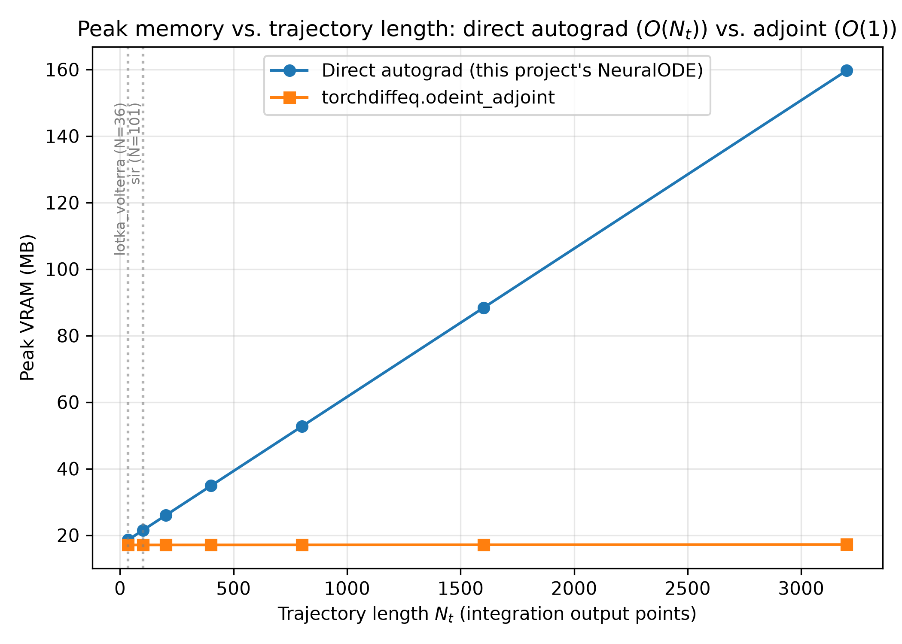

# Track A -- Adjoint vs. Autograd Profiling: Findings

> Table 4 and the figure are `run_profile.py`'s actual measured output on an RTX 3060 (`results/phase3/adjoint_profiling/table4.json`). The Finding section below was written from that data. Worth a final human read before treating it as submission-ready, but it is not a placeholder.

## Research question

`implementation/README.md` documents direct autograd through the unrolled solver as a deliberate choice for this project's short trajectories ($N=36$-$101$ points), on the grounds that adjoint sensitivity's $O(1)$-memory advantage doesn't matter until trajectories get long. This track measures whether that holds, on real hardware (NVIDIA GeForce RTX 3060), and where it stops holding.

## Method

Both paths run classical RK4 at a **matched step size** -- this project's own `NeuralODE(method='rk4')` for direct autograd, `torchdiffeq.odeint_adjoint(method='rk4', options={'step_size':...})` for the adjoint path. A forward-trajectory check (`tests/test_p3_adjoint_profiling.py`) confirms the two RK4 implementations agree to ~1e-7 relative error, so this isolates the differentiation method as the only variable -- any difference below is attributable to backprop-through-unrolled-solver vs. continuous-adjoint-ODE, not to comparing two different integrators.

## Table 4 -- peak VRAM, wall-clock, gradient accuracy

| System | $N_t$ | Method | Peak VRAM (MB) | s / 1000 epochs | Grad rel. error |
| :--- | :---: | :--- | :---: | :---: | :---: |
| Lotka-Volterra | 36 | Direct autograd | 18.61 | 317.52 | 2.85e-07 |
| Lotka-Volterra | 36 | Adjoint | 17.08 | 672.85 | (same row) |
| SIR | 101 | Direct autograd | 21.52 | 984.75 | 4.88e-07 |
| SIR | 101 | Adjoint | 17.12 | 1871.64 | (same row) |

## Memory vs. trajectory length

Sweeping $N_t \in \{36, 101, 201, 401, 801, 1601, 3201\}$ with a single forward+backward pass per point (isolating the memory claim from training-loop/optimizer overhead): direct autograd grows linearly, $18.6\to159.7$ MB, a slope of $\approx 0.045$ MB per output point. Adjoint stays essentially flat, $17.07\to17.19$ MB -- a 0.7% increase over a $89\times$ increase in trajectory length, consistent with $O(1)$.

**There is no crossover inside the tested range, because adjoint is already cheaper at every single point tested, including the smallest ($N_t=36$).** The naive framing of this experiment ("find where adjoint starts winning") presupposes direct autograd is cheaper at short lengths -- that turned out to be false even at the paper's own $N=36$ regime. Extrapolating the observed linear slope, direct autograd would need roughly $N_t \approx 225{,}000$ to add another 10 GB and meaningfully threaten a 12 GB card -- three to four orders of magnitude beyond anything in this project ($N \le 101$).

## Finding

**`implementation/README.md`'s claim -- adjoint sensitivity is unnecessary here -- holds, but not for the reason originally stated.** The stated justification was that adjoint's $O(1)$-memory advantage doesn't matter for short trajectories, implicitly because direct autograd is the cheaper option at that scale. That premise is wrong: adjoint already uses *less* memory than direct autograd at $N=36$ (17.08 MB vs 18.61 MB) and at $N=101$ (17.12 MB vs 21.52 MB), and the gap only widens with length. The reason adjoint is still the wrong choice for this project is different -- **wall-clock, not memory**:

| System | Direct autograd | Adjoint | Slowdown |
| :--- | :---: | :---: | :---: |
| Lotka-Volterra ($N=36$) | 317.5 s / 1k epochs | 672.9 s / 1k epochs | **2.12x** |
| SIR ($N=101$) | 984.7 s / 1k epochs | 1871.6 s / 1k epochs | **1.90x** |

Solving the continuous adjoint ODE backward in time costs a consistent ~1.9-2.1x wall-clock overhead relative to backprop through the unrolled solver, at both tested trajectory lengths. Extrapolated to this project's standard 10,000-epoch training budget, switching to adjoint would turn a ~53-minute Lotka-Volterra run into ~112 minutes, and a ~2.7-hour SIR run into ~5.2 hours, for a memory saving that is never load-bearing: peak usage tops out at 21.5 MB against the RTX 3060's 12,288 MB -- 0.17% of capacity, even at $N=101$.

Both gradient-relative-error checks passed well inside tolerance ($2.85\times10^{-7}$ and $4.88\times10^{-7}$, against a $5\times10^{-3}$ target), confirming the two differentiation methods agree numerically -- the choice between them here is purely a resource trade-off, and at this project's scale it trades a real (if currently irrelevant) memory advantage for a real, immediate ~2x wall-clock cost. **Direct autograd remains the correct default for this project.** Adjoint would only become the better choice if trajectories grew by several orders of magnitude (into the $10^5$-point range per the extrapolation above) or if the project moved to hardware with far less VRAM headroom than a 12 GB card -- neither applies to any dataset in this project's scope (Lotka-Volterra, SIR, damped pendulum, all $N \le 201$).
