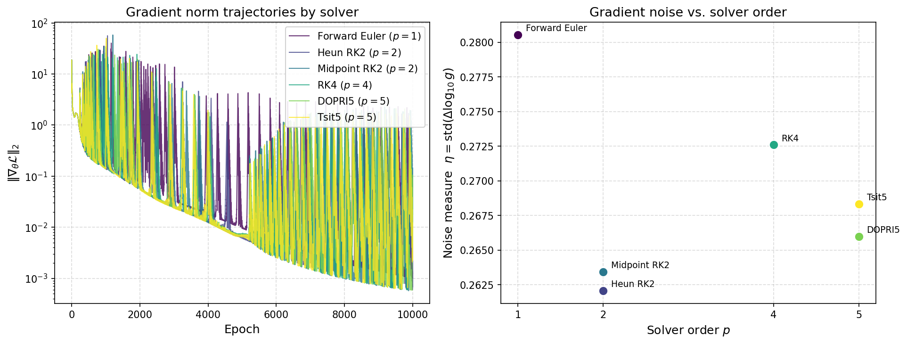

# 📉 Track B — Gradient Norm Dynamics vs. Solver Order

> **Status:** complete — negative result
> **Owner:** Abhishek Roy (2105033) · **Branch:** `feat/p3-gradient-dynamics`
> **Chain:** [`12`](./12_phase3_roadmap.md) Phase 3 roadmap §Track B → **this doc**
> **Artifacts:** [`experiments/gradient_dynamics/`](../implementation/experiments/gradient_dynamics/) ·
> [`results/phase3/gradient_dynamics/`](../implementation/results/phase3/gradient_dynamics/)

---

## 1. The question

Phase 2 established that Forward Euler is the odd one out among the six solvers: it is
the **only** solver that fails to reach $10^{-4}$ training loss within the 10,000-epoch
budget, and its extrapolation MSE is $28\times$ worse than Tsit5's
([`05`](./05_phase2_benchmark_analysis.md) §Table 1). That is a *what*, not a *why*.

The proposed mechanism was gradient quality: a first-order solver commits $O(\Delta t)$
local truncation error on every step of the forward integration, and that error
propagates into the backward pass. If low-order solvers produce measurably **noisier**
gradients epoch-to-epoch, that would be a concrete mechanism for Euler's loss floor —
noisy gradients destabilise Adam's moment estimates and prevent settling into a sharp
minimum, which looks like a floor rather than slow convergence.

**This document tests that hypothesis and reports that it does not hold.**

---

## 2. Method

### 2.1 Data — zero new training

All six solver-ablation runs already log $\|\nabla_\theta\mathcal{L}\|_2$ once per epoch
(`compute_gradient_norm`, `utils/metrics.py:85`). Track B is pure analysis of
`results/benchmarks/ablation_solvers/solver_*/training_history.json` — 10,000 epochs
per solver, six solvers, accessed read-only. No model was retrained.

**Clipping caveat.** These six runs predate [`07`](./07_fix_changelog.md) §`FIX-2026-08`,
so no `post_clip_grad_norms[]` key exists in any of them. Every norm reported here is
**raw and unclipped** — which is the right data for this question, since clipping would
have compressed exactly the fluctuations being measured.

### 2.2 The noise measure, and why this one

Gradient norms span orders of magnitude both within and across runs, so a raw standard
deviation would rank solvers by their absolute gradient scale rather than by roughness.
The measure used is therefore computed in log space:

$$\eta \;=\; \mathrm{std}\big(\Delta \log_{10} g\big), \qquad \Delta \log_{10} g_i = \log_{10} g_{i+1} - \log_{10} g_i$$

i.e. the standard deviation of epoch-to-epoch **relative** change. A smoothly decaying
curve — steady relative progress — scores near zero regardless of its magnitude, while a
curve that jitters up and down between consecutive epochs scores high. This is
scale-invariant by construction and requires no arbitrary window size, unlike the
rolling coefficient of variation the roadmap offered as the alternative.

Non-finite and non-positive entries are dropped before the logarithm: a zero or NaN norm
is a failure, not a small fluctuation, and admitting it would silently yield $-\infty$.

### 2.3 The statistic

**Spearman** rank correlation between solver order $p$ and $\eta$, not Pearson. Solver
order is an ordinal scale with only four distinct values (1, 2, 4, 5) and a deliberate
tie at $p=2$ (Heun and Midpoint are both RK2; there is no principled basis for splitting
them, and Spearman handles ties natively). The hypothesis under test is **monotonicity**
— "does noise fall as order rises?" — not linearity.

---

## 3. Results

### 3.1 The table

| Solver | Order $p$ | Noise $\eta$ | Mean $\|g\|$ | Best train MSE | Noise rank |
| :--- | :---: | :---: | :---: | :---: | :---: |
| Forward Euler | 1 | **0.2805** | 0.8766 | $1.377\times10^{-4}$ | 1 |
| Classical RK4 | 4 | 0.2726 | 0.5854 | $9.413\times10^{-5}$ | 2 |
| Tsit5 | 5 | 0.2683 | 0.4796 | $8.833\times10^{-5}$ | 3 |
| DOPRI5 | 5 | 0.2660 | 0.5478 | $9.283\times10^{-5}$ | 4 |
| Midpoint RK2 | 2 | 0.2634 | 0.4990 | $8.857\times10^{-5}$ | 5 |
| Heun RK2 | 2 | 0.2621 | 0.4877 | $8.315\times10^{-5}$ | 6 |

**Spearman $\rho = -0.088$, $p = 0.87$, $n = 6$.**

### 3.2 Three reasons the hypothesis fails

**The effect size is negligible.** The entire spread across six solvers is
0.2621–0.2805 — a **7% range**. Euler is nominally noisiest, but not by a margin that
could plausibly separate a converging run from a failing one.

**The ranking is not monotone.** RK4 ($p{=}4$) is the *second*-noisiest solver, ahead of
both second-order methods. A mechanism driven by truncation error cannot produce an
ordering in which $p{=}4$ is noisier than $p{=}2$.

**The correlation is not robust.** Because $n=6$ is small, the analysis re-runs the
correlation at four warm-up cuts. The sign **flips**:

| Warm-up epochs dropped | $\rho$ | $p$-value |
| :---: | :---: | :---: |
| 0 | $-0.088$ | 0.87 |
| 500 | $-0.088$ | 0.87 |
| 2,000 | $-0.441$ | 0.38 |
| 5,000 | $+0.706$ | 0.12 |

No cut reaches significance, and the direction of the relationship depends entirely on
where the start-up transient is trimmed. A result that changes sign based on an analyst's
free choice is not evidence for either direction. Reporting only the $-0.441$ cut would
have produced a much more flattering — and dishonest — story.

### 3.3 What the figure actually shows



The left panel explains *why* all six noise values collapse into a 7% band. Every trace
is dominated by large, **sustained spike bursts** — gradient norms jumping one to two
orders of magnitude above the local median for runs of consecutive epochs, then
subsiding. Spot-checking the last 4,000 epochs, Euler shows 1,176 such spike-epochs and
Tsit5 shows 866, with near-identical burst structure (median gap of 1 epoch in both).

This structure is present in the first-order and fifth-order solvers alike, so it is
**not** solver truncation error. It is a shared property of the optimisation — most
plausibly Adam interacting with the KAN's basis-function landscape — and it dominates the
variance the noise measure is trying to attribute to solver order. Any order-dependent
signal is buried beneath it.

---

### 3.4 Are the spike bursts a bug? — four checks say no

Because the spike bursts are unexpected, they were checked directly against the
hypothesis that they indicate a defect in the KAN-ODE implementation. They do not.

**No numerical failures.** Across all 60,000 logged epochs (6 solvers × 10,000), there
are **zero** non-finite gradient norms and zero non-finite losses. Peak gradient norms
are 28.6–58.2 — an ordinary magnitude. A genuine exploding-gradient defect would show
$10^6$-scale values or NaN.

**Training never stalls.** Loss decreases monotonically in its running minimum for every
solver and is still falling at epoch 9,999 (Euler: $3.44\times10^{-2} \to
1.71\times10^{-3} \to 1.38\times10^{-4}$; Tsit5: $2.77\times10^{-2} \to 4.77\times10^{-4}
\to 8.83\times10^{-5}$). Euler did not diverge or plateau — it descended *more slowly*
and was still just above $10^{-4}$ when the epoch budget ran out.

**Spikes are transient, not damaging.** Loss is lower five epochs after a spike in
**64.5%** of cases. The optimiser recovers and continues descending.

**Spikes are visible in the loss, not just the gradient.** On spike epochs the median
training loss is $3.90\times10^{-4}$, versus $1.80\times10^{-4}$ on calm epochs — a 2.2×
difference. This is the decisive check: the gradient is not spuriously large while the
loss sits still, which is what a backward-pass bug would look like. The optimiser is
genuinely entering steeper regions of the loss surface and then leaving them.

The most plausible reading is **edge-of-stability** behaviour: with a fixed
$\text{lr}=0.002$ and no scheduler, Adam periodically overshoots the walls of an
increasingly narrow loss valley as training approaches $10^{-4}$, then recovers. This is
well-documented, benign optimisation dynamics rather than a defect — but it does suggest
a concrete, low-cost improvement for Phase 4: **adding a learning-rate scheduler**
(cosine decay or `ReduceLROnPlateau`) would likely suppress the bursts and let every
solver reach a lower floor. Phase 2's conclusions are unaffected.

---

## 4. Finding

> **Gradient-norm roughness does not explain Euler's convergence failure.** Across the
> six solver-ablation runs, log-step noise varies by only 7% ($\eta \in [0.262, 0.281]$),
> is non-monotone in solver order (RK4 ranks second-noisiest), and correlates with order
> at $\rho = -0.088$ ($p = 0.87$) — a correlation whose sign flips to $+0.706$ if the
> first 5,000 epochs are dropped. Euler is nominally the noisiest solver and does have
> the worst training loss ($1.38\times10^{-4}$ vs. $8.3$–$9.4\times10^{-5}$), but at this
> effect size and sample size that co-occurrence is not evidence of a mechanism. The
> gradient traces are instead dominated by sustained spike bursts common to **all** six
> solvers, including Tsit5 — a shared optimiser-landscape effect, not a truncation-error
> effect.

**The link to Phase 2's Euler failure is therefore explicitly refuted, not drawn.** The
roadmap's definition of done required this to be stated either way; the honest answer is
that the more likely mechanism remains the one Phase 2 already proposed — Euler's
$O(\Delta t)$ local error injecting a *systematic bias* into the learned vector field
([`05`](./05_phase2_benchmark_analysis.md) §Interpretation) — rather than gradient-level
stochastic noise. A systematic bias would shift *where* the optimiser converges without
making the path there measurably rougher, which is exactly the pattern observed.

---

## 5. Caveats and what would strengthen this

- **$n = 6$ is a hard ceiling** on any correlation claim. Six points with a tie cannot
  reach $p < 0.05$ at moderate effect sizes; this analysis can only rule out *large*
  effects, which it does.
- **Single seed, single system.** All six runs are seed 42 on Lotka-Volterra. Whether the
  spike-burst structure is seed-specific or systematic is untested. Phase 4's multi-seed
  replication ([`12`](./12_phase3_roadmap.md) §5.4) would settle this cheaply, since no
  new training is needed beyond the seeds already planned.
- **The spike bursts are an unexplained finding in their own right.** They appear in every
  solver, are sustained rather than isolated, and are large enough to dominate the
  variance. Characterising them — are they loss-landscape cliffs, an Adam $\epsilon$
  artifact, or basis-grid boundary crossings? — is a better-posed follow-up question than
  re-running this correlation with more seeds.
- **One measure, not a family.** $\eta$ was chosen and justified *a priori* (§2.2) rather
  than selected after seeing which of several candidates gave the strongest correlation.
  That discipline is why the negative result is trustworthy.

---

## 6. Reproducing

```powershell
python implementation/experiments/gradient_dynamics/analyze_gradient_dynamics.py
python -m pytest tests/test_p3_gradient_dynamics.py -q
```

Runs in seconds on CPU. No new dependencies; `requirements.txt` untouched.

Outputs: [`table.json`](../implementation/results/phase3/gradient_dynamics/table.json)
(per-solver statistics, the correlation, and the full warm-up sensitivity sweep) and
[`gradient_noise_by_order.png`](../implementation/results/phase3/gradient_dynamics/gradient_noise_by_order.png).

---

*Part of [Phase 3](./12_phase3_roadmap.md). Track B is independent of Tracks A, C, D, E —
no shared file was modified.*
