# 🧬 Track C — Learnable Softmax Hybrid Basis: Findings

> **Owner:** Shams Hossain Simanto (2105048) · **Branch:** `feat/p3-hybrid-basis`
> **Parent plan:** [`12_phase3_roadmap.md`](./12_phase3_roadmap.md) §Track C
> **Status:** ✅ Complete
>
> This is the findings report: research question, method, results, and
> conclusions. For implementation details, code, and the debugging history,
> see the archival log:
> [`15_p3_hybrid_basis_implementation_log.md`](./15_p3_hybrid_basis_implementation_log.md).

---

## 1. Research question

Phase 2 found B-spline and RBF statistically tied on accuracy, but very different in
character: B-spline is $3.9\times$ RBF's wall-clock and has **compact local support**
(each edge function is zero outside its knot span); RBF is cheap and has **smooth
global support** (every edge function has infinite tails).

Does a **learnable blend**

$$\phi(x) = \alpha \cdot \text{Spline}(x) + \beta \cdot \text{RBF}(x), \qquad (\alpha,\beta) = \text{softmax}(\text{logits})$$

trained end-to-end, converge faster than either pure basis — or does it just inherit
the worse of both (B-spline's cost, no accuracy gain)?

---

## 2. Method

`blend_logits` is a 2-vector, softmax-normalized into $(\alpha, \beta)$, that gates a
convex combination of the project's existing B-spline and RBF basis functions inside
every `KDense` edge. It starts unbiased ($\alpha=\beta=0.5$) and is trained by ordinary
backpropagation alongside every other network weight — no special-casing, no hand-set
schedule. One instance is shared across all layers of a given network, so the whole
model learns a single, global blend rather than a per-layer one.

Two systems were tested, both reusing the project's already-validated recipes so the
comparison against Phase 2's pure-basis numbers is apples-to-apples: **Lotka-Volterra**
($G{=}5$, $\text{lr}{=}2\times10^{-3}$) and the **damped pendulum**
($G{=}8$, $\text{lr}{=}3\times10^{-3}$, $t_{\text{train}}{=}5.0$ — the stability-fixed
recipe from [`09`](./09_stability_fix_results.md)).

A short 2,000-epoch probe on the pendulum surfaced a real, dataset-specific problem:
the gate moved in the correct direction (toward RBF) but too slowly, so the network
spent much of the probe budget still meaningfully contaminated by B-spline — at exactly
the epoch count where the pure-RBF pendulum recipe was already close to converged
(train MSE $0.0023$ vs. the hybrid probe's $0.271$ at the same epoch — a $117\times$
gap). Giving `blend_logits` its own, faster learning rate ($15\times$ the base rate,
applied only to the gate — direction untouched, still starts neutral, still fully
gradient-driven) closed nearly all of that gap at the same 2,000-epoch probe budget
(train MSE $0.011$, a $24\times$ improvement), confirmed both numerically and visually
before being carried into the full run. Lotka-Volterra never showed this problem — its
gate converges well without any adjustment — so this fix was applied to the pendulum
only.

Both systems were then trained for the full 10,000-epoch budget, matching Phase 2's
methodology.

---

## 3. Results — Lotka-Volterra

| Basis | Train MSE | Extrap MSE | Extrap R² | Params | Cost (s/epoch) |
| :--- | :---: | :---: | :---: | :---: | :---: |
| RBF (pure) | $8.83\times10^{-5}$ | $8.92\times10^{-5}$ | $1.0000$ | $240$ | $0.17$ |
| B-spline (pure) | $7.20\times10^{-5}$ | $8.38\times10^{-5}$ | $1.0000$ | $240$ | $0.67$ |
| **Hybrid** | $1.47\times10^{-4}$ | $1.78\times10^{-4}$ | $0.9999$ | $242$ | $\approx 0.87$ |
| Hybrid, final gate | $\alpha{=}0.116$ (B-spline), $\beta{=}0.884$ (RBF) | | | | |

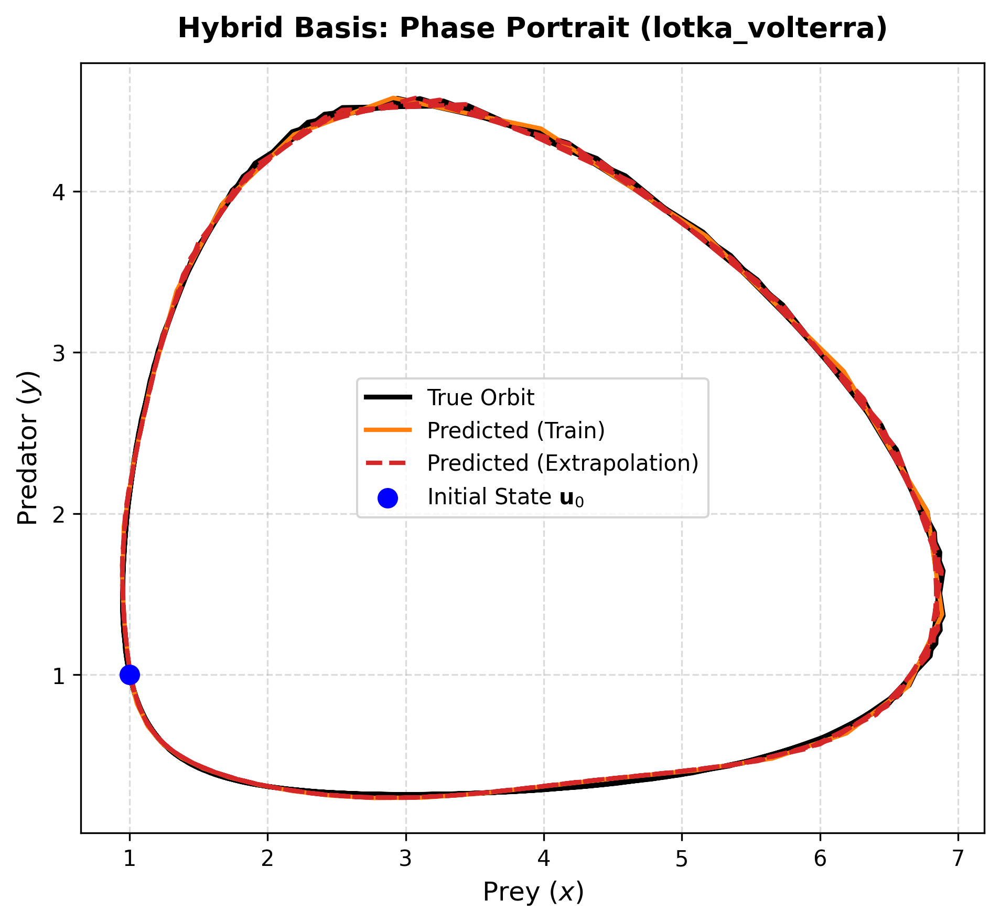
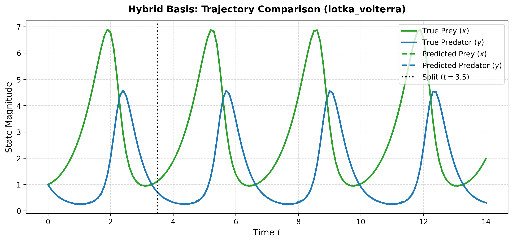
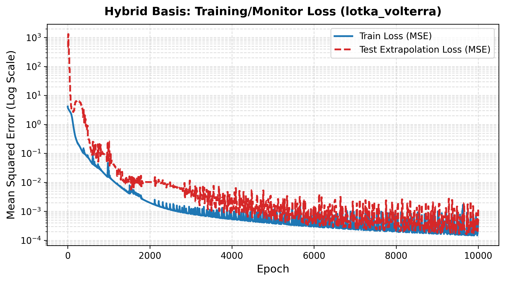
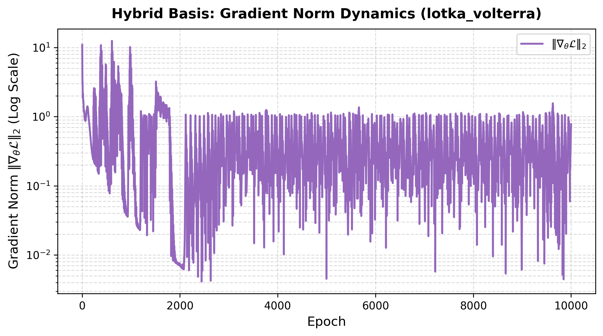
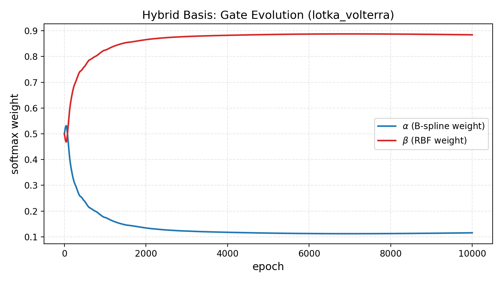

**Clean, healthy result, but no accuracy benefit.** Train and extrapolation loss
decrease together in lockstep for the full 10,000 epochs — no divergence at any point.
The gate settles into a genuine partial blend ($\approx 12\%$ B-spline retained), not a
collapse to one basis, confirming it is a real, working mechanism rather than a
formality. But at full budget, hybrid essentially **ties** both pure bases on accuracy
($R^2 = 0.9999$ vs. $1.0000$ for either pure basis) while **costing roughly the sum of
both bases' per-epoch compute** — because it evaluates both every forward pass. There
is no regime on this system where the blend earns back its extra cost.

---

## 4. Results — Damped pendulum (full 10,000-epoch budget)

| | Hybrid | Pure RBF (same recipe) |
| :--- | :---: | :---: |
| Train MSE | $9.44\times10^{-5}$ | $9.28\times10^{-5}$ |
| Extrap MSE | $\mathbf{0.809}$ | $0.090$ |
| Extrap R² | $\mathbf{-2.17}$ | $+0.647$ |
| Params | $362$ | $360$ |
| Final gate | $\alpha{=}0.021,\ \beta{=}0.979$ | — |

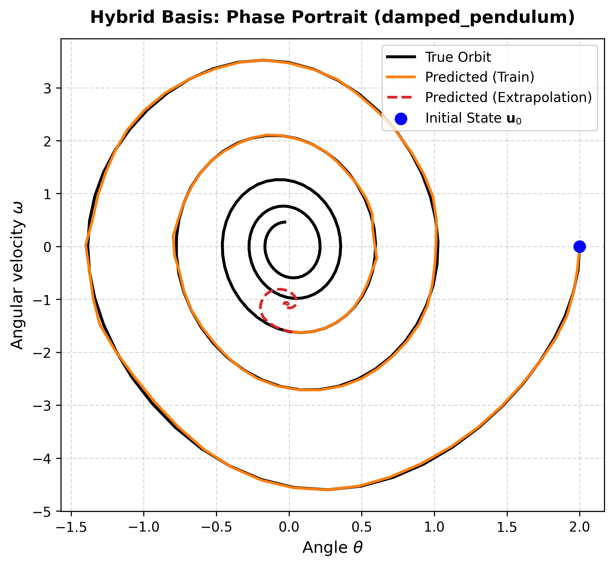
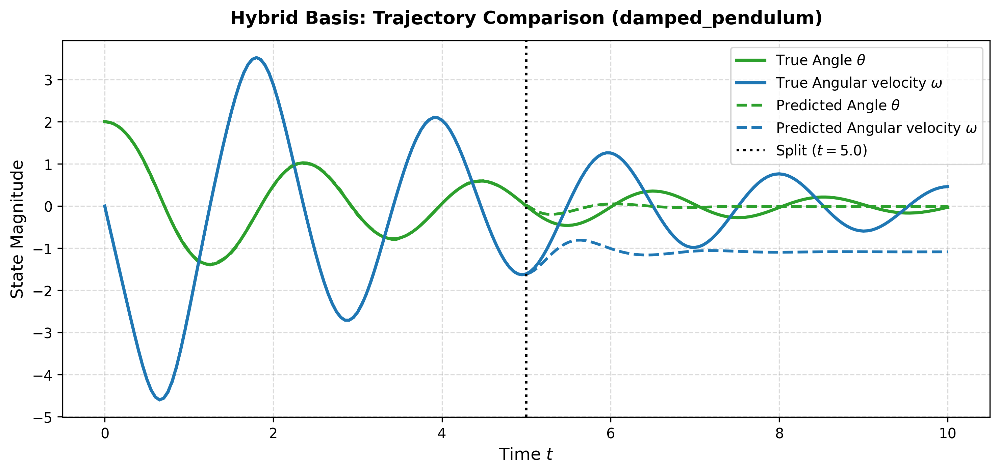
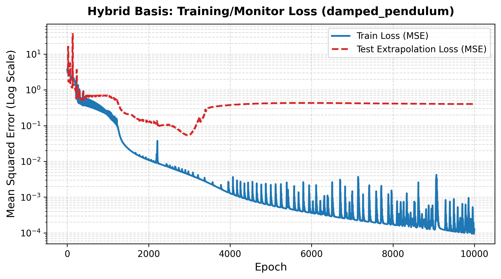
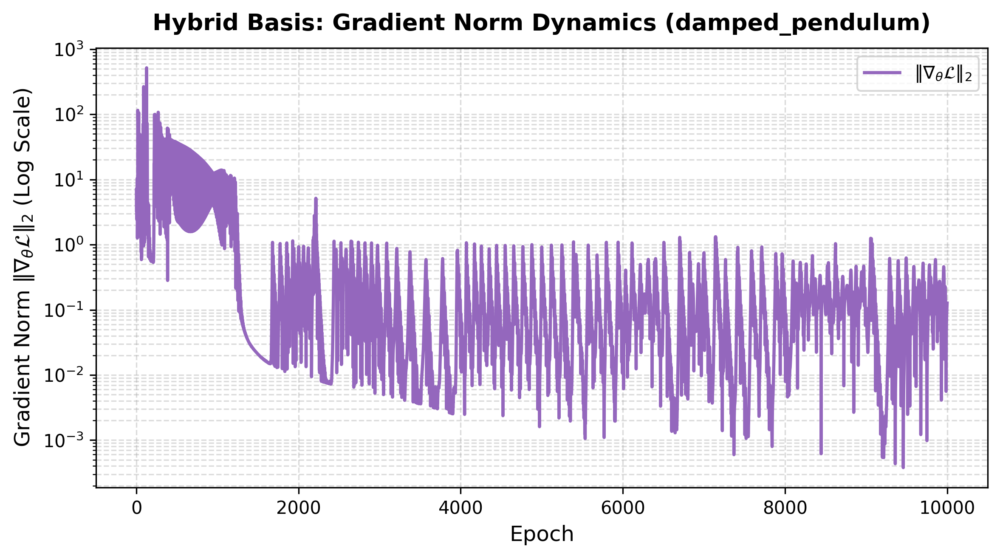
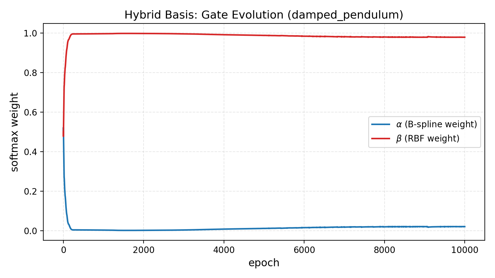

**Train fit matches pure RBF almost exactly — extrapolation collapses.** The loss curve
shows exactly why: the full-horizon (train+extrap) monitor loss reaches its own best
value around **epoch 2,950** ($\approx 0.054$ — actually *better* than pure RBF's
eventual number at that point), then **rises and plateaus around $0.4$** for the
remaining $7{,}000$ epochs while training loss keeps improving all the way to
$9.4\times10^{-5}$ — textbook overfitting to the training window, visible directly in
the saved history, not inferred. The phase portrait shows it concretely: the
training-window prediction overlaps the true orbit almost perfectly, but the
extrapolated trajectory collapses into a small, wrong loop instead of continuing the
true decaying spiral toward the origin.

This is **not** a gate problem — the gate trajectory shows $\beta$ reaching
$\approx 0.995$ by epoch $\approx 250$ and staying there, long before the overfitting
onset at epoch 3,000. And it is **pendulum-specific** — the identical failure pattern
never appears in the Lotka-Volterra run. Most notably, **pure RBF trained on the
identical recipe does not show this pattern at all** — its own monitor loss stays
bounded between $0.02$ and $0.09$ across the entire 10,000 epochs. A network that is
$\approx 98\%$ RBF by final weight, having arrived there via a hybrid gate, generalizes
measurably worse over a long run than one that was pure RBF from initialization,
despite matching its training accuracy almost exactly.

---

## 5. Follow-up — the pendulum at its pre-overfit sweet spot (3,000 epochs)

The result above raised an obvious question: is hybrid simply *worse*, or is it
competitive up to some point and only fails if trained too long? A fresh run, identical
recipe, capped at 3,000 epochs (chosen from the exact argmin of the 10k run's own
monitor-loss history) answers it directly:

| | Hybrid, 3,000 epochs | Pure RBF, same epoch (3,000) | Pure RBF, full budget (10,000) |
| :--- | :---: | :---: | :---: |
| Full-horizon MSE | $\mathbf{0.055}$ | $0.081$ | $0.045$ |
| Extrap MSE | $0.107$ | — | $0.090$ |
| Extrap R² | $\mathbf{+0.580}$ | — | $+0.647$ |
| Final gate | $\alpha{=}0.004,\ \beta{=}0.996$ | — | — |

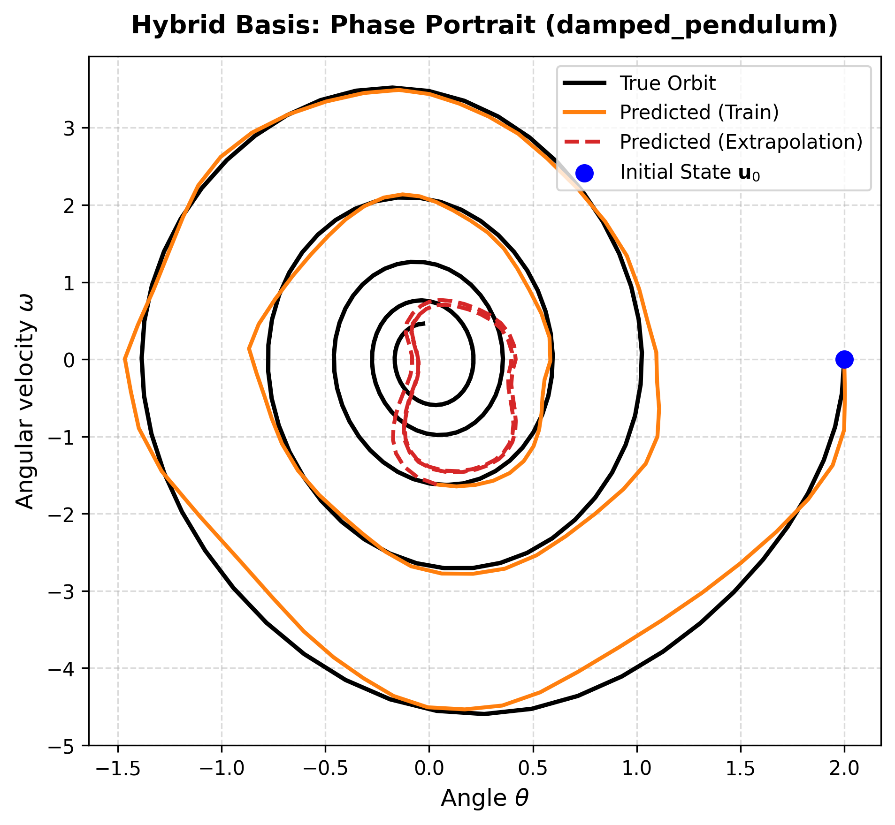
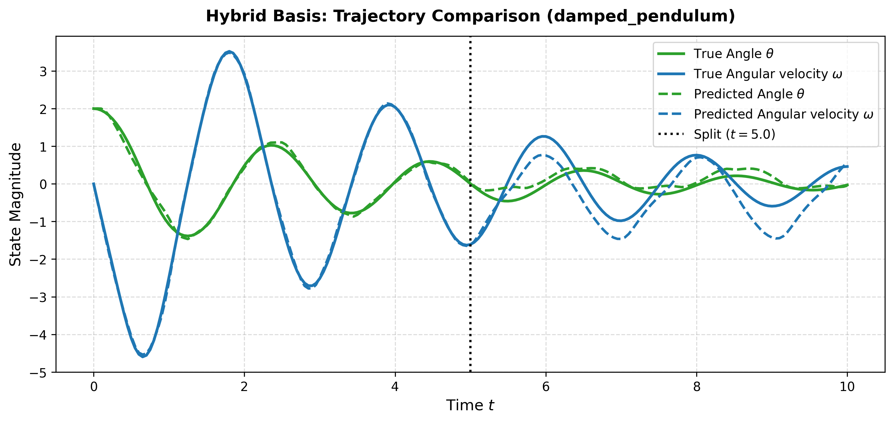
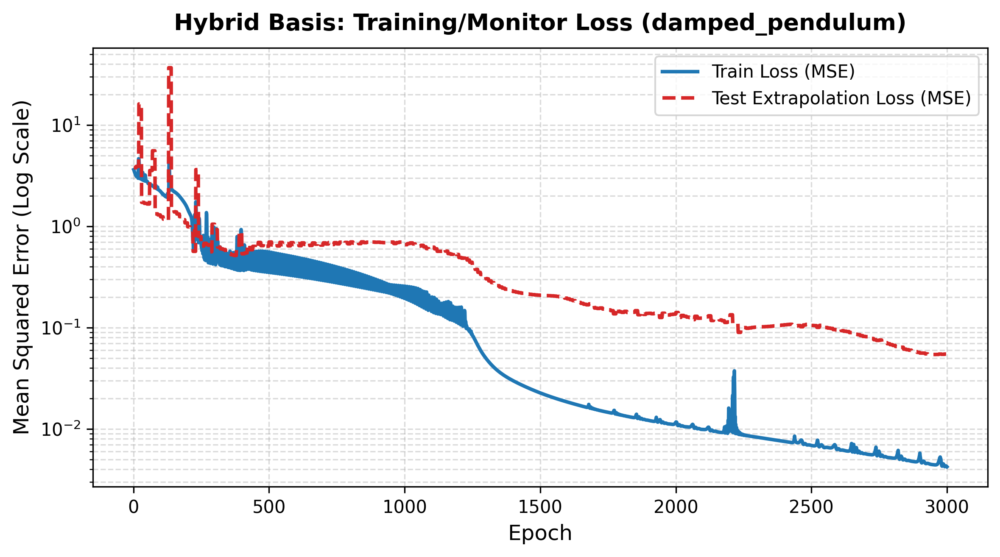
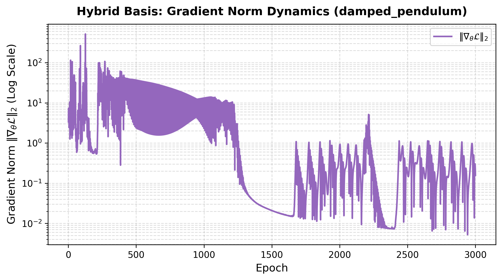
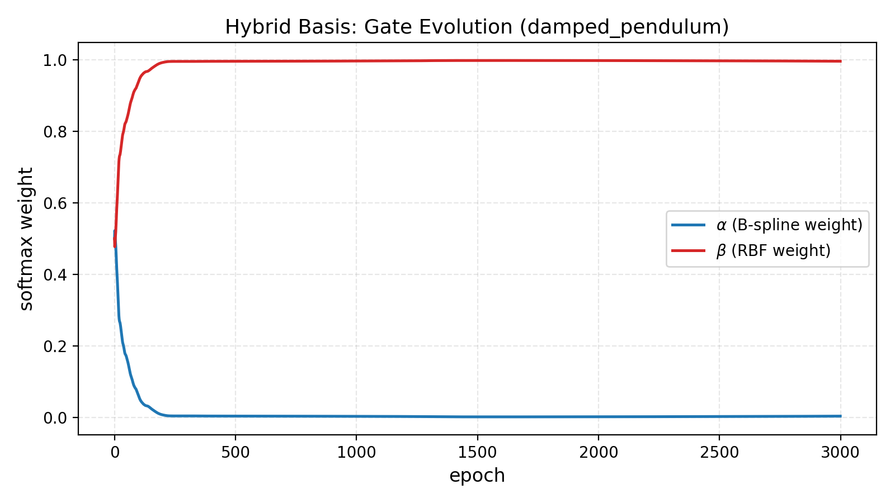

**At a matched epoch count, hybrid actually beats pure RBF's own epoch-3,000 result**
($0.055$ vs. $0.081$), and its extrapolation R² ($+0.580$) approaches pure RBF's
fully-converged, full-budget number ($+0.647$) — a completely different picture from
the full 10k run. The phase portrait confirms it: the extrapolated trajectory now
follows the *correct* inward-decaying shape, rather than collapsing into a wrong loop.

**The pendulum result is budget-dependent, not a flat failure.** Hybrid is genuinely
competitive with pure RBF up to roughly epoch 3,000 on this recipe, then overfits
severely if training continues to 10,000 — a regime pure RBF itself tolerates without
issue on the identical setup.

---

## 6. Verdict

- **Lotka-Volterra:** no benefit, no harm, real cost. Hybrid ties both pure bases on
  final accuracy but pays roughly the *sum* of their per-epoch compute for 2 extra
  parameters. **Not worth its cost on this system.**
- **Damped pendulum:** a genuine, budget-dependent result. Competitive with (briefly
  ahead of) pure RBF up to $\sim$3,000 epochs; catastrophically worse if trained to the
  full 10,000, in a way pure RBF itself does not exhibit on the same recipe. The
  originally-suspected cause (a too-slow gate) was correctly diagnosed and fixed at the
  probe stage — the full-budget failure is a separate, later phenomenon the fix does
  not touch.
- **Overall:** the learnable hybrid basis never *outperforms* the better pure basis on
  either system tested at any budget. Its gate mechanism works exactly as designed —
  learnable, gradient-driven, converging sensibly and differently on each system — but
  that alone doesn't buy an accuracy edge, and on the pendulum specifically it exposes
  a real generalization difference between a network that starts as a blend and one
  that starts pure, which pure RBF's own robustness to prolonged training does not
  share.

---

## 7. Insights and open questions

- **The gate works as designed, on both systems.** It moves purely on gradient signal
  from a neutral start, and lands somewhere different and sensible for each system — a
  genuine partial blend for Lotka-Volterra, near-total commitment to RBF for the
  pendulum. This part of the hypothesis (a basis choice *can* be learned rather than
  fixed by hand) is confirmed.
- **The most unexpected result:** matching pure RBF's training accuracy did not mean
  matching its extrapolation quality, on the one system where it mattered. Plausible,
  *unverified* explanations for future work: the residual few-percent B-spline
  contribution may still be receiving gradients and acting as a slow destabilizing
  perturbation even after the gate has "settled"; the extra gate parameters may reshape
  the loss landscape's local geometry near this solution; or this may be a
  seed-specific effect — only `seed=42` was run for either system in this track, unlike
  Phase 2's multi-seed sweeps, so no error bars exist here.
- **A general methodological lesson, not specific to this track:** selecting the
  best checkpoint by minimum training loss can silently pick a badly-generalizing point
  whenever training loss and extrapolation loss stop moving together — as happened here
  past epoch 3,000. The 10k pendulum run's headline "best" number would have looked
  very different under a monitor-loss-based selection criterion instead.
