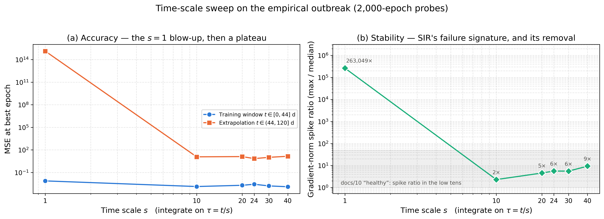
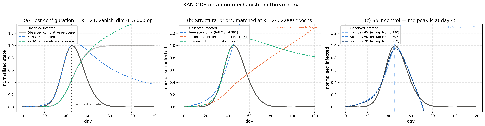

# 🧬 Track E: SINDy Comparison + Real Epidemic Fit

> **Owner:** Monjur Hossain Khan ("Shovon") — **2105043**
> **Branch:** `feat/p3-sindy-epidemic` · **Plan:** [`12`](./12_phase3_roadmap.md) §Track E (Novelty 4 + narrowed Novelty 6)
> **Code:** [`implementation/experiments/sindy_epidemic/`](../implementation/experiments/sindy_epidemic/) · **Results:** [`implementation/results/phase3/sindy_epidemic/`](../implementation/results/phase3/sindy_epidemic/)
> **Tests:** `tests/test_p3_sindy_epidemic.py` (33, no training required)
> **Reproduce:** `cd implementation/experiments/sindy_epidemic && python run_all.py`

---

## 🔭 What this track asked

Two questions, bundled because both compare a learned model against an
**independent** form of ground truth:

| | Question |
| :-: | :--- |
| **E1** | SINDy fits by sparse regression against a symbolic library; KAN-ODE fits by gradient descent through a solver. They break for different reasons. Which degrades more gracefully under observational noise — and are KAN's edges sparse enough to compare term-by-term at all? |
| **E2** | [`10`](./10_sir_root_cause_and_fix.md) rescued SIR with fixes derived from the SIR *generator's* own structure. Do they transfer to outbreak data no compartmental ODE produced? |

Every E2 claim below was **predicted first from the fix's own preconditions, then
checked with a control arm.** That discipline earned its keep twice: it overturned one
of the three predictions (§2.5), and it turned an apparent failure of the method into
a property of the train/test split (§2.6).

**Four headline findings, up front:**

1. **KAN-ODE is more accurate than SINDy at every noise level, but SINDy is far more *robust*.** KAN's extrapolation advantage collapses from $1110\times$ at $\sigma=0$ to $6.5\times$ at $\sigma=0.1$.
2. **The term-by-term symbolic comparison the blueprint asked for is not available — and now there is a number for why.** Removing the 2 weakest of 40 edges degrades the model by $3.9\times10^{4}$, to *worse than a constant predictor*. These KANs have no prunable structure, because nothing ever asked them for any.
3. **Two of SIR's three fixes transfer to non-mechanistic data; one does not — and the one that surprised us is `vanish_dim`.** It was predicted inapplicable and is instead the best single option tested ($47\times$ better fit), while `conserve_mode projection` fails as predicted. Every prediction was checked with a control arm; **one in three was wrong.**
4. **KAN-ODE's apparent inability to extrapolate the outbreak is an artifact of the split, not the method.** The default split lands *exactly* on the infected peak, leaving $0\%$ of the decay in the training window. Move it 15 days and the runaway collapses from a predicted peak of $6.18$ to $0.964$ against a true $1.0$.

---

# Part 1 — E1: SINDy vs. KAN-ODE under noise

## 1.1 Protocol — what makes this apples-to-apples

Both methods see the **same data**. The Lotka-Volterra generator, horizon, split,
seed and noise draw are read out of each Phase-2 checkpoint's own `config` rather
than restated, so the trajectory SINDy fits is bit-identical to the one the KAN at
that $\sigma$ trained on. Both are scored the same three ways `train.py` scores
everything, **against the clean ground truth** — noise corrupts the observations,
never the target.

The KAN side is the existing `results/benchmarks/noise/sigma*` checkpoints
**re-integrated, never retrained**. That rebuild is the failure mode
[`10`](./10_sir_root_cause_and_fix.md) §Part 5 catalogues, so it is pinned by test:
re-integration reproduces all four runs' *published* `metrics.json` numbers to a
relative $10^{-4}$.

| Setting | Value |
| :--- | :--- |
| SINDy library | `PolynomialLibrary(degree=2)` — contains $x$, $y$, $x^2$, $xy$, $y^2$, $1$ |
| SINDy optimizer | `STLSQ(threshold=0.05)`, **held fixed across $\sigma$** so the sweep measures noise sensitivity, not per-level tuning |
| Differentiation | two arms: plain `FiniteDifference` and `SmoothedFiniteDifference` |
| Training window | $t \in [0, 3.5]$, 36 points, $\Delta t = 0.1$ |
| Ground truth | $\dot x = 1.5x - xy$, $\dot y = xy - 3y$ |

## 1.2 Result — accuracy vs. robustness pull in opposite directions

MSE against clean ground truth, best-epoch KAN checkpoint, SINDy fit on the same window:

| $\sigma$ | SINDy (FD) train | SINDy (FD) extrap | KAN train | KAN extrap | **KAN advantage (extrap)** |
| :-: | :-: | :-: | :-: | :-: | :-: |
| $0.00$ | $4.78\times10^{-3}$ | $9.90\times10^{-2}$ | $\mathbf{8.83\times10^{-5}}$ | $\mathbf{8.92\times10^{-5}}$ | $\mathbf{1110\times}$ |
| $0.01$ | $1.72\times10^{-2}$ | $1.58\times10^{-1}$ | $1.23\times10^{-4}$ | $1.22\times10^{-3}$ | $130\times$ |
| $0.05$ | $8.56\times10^{-2}$ | $1.48\times10^{-1}$ | $7.41\times10^{-4}$ | $2.54\times10^{-2}$ | $5.8\times$ |
| $0.10$ | $2.32\times10^{-1}$ | $8.89\times10^{-1}$ | $2.28\times10^{-3}$ | $1.37\times10^{-1}$ | $6.5\times$ |

**Degradation from $\sigma=0$ to $\sigma=0.1$:**

| Method | train | extrap |
| :--- | :-: | :-: |
| SINDy (FD) | $48.5\times$ | $\mathbf{9.0\times}$ |
| KAN-ODE | $25.8\times$ | $1540\times$ |

> **The finding.** KAN-ODE wins on absolute accuracy at every noise level tested,
> but the *margin* collapses by $170\times$ across the sweep. SINDy's extrapolation
> error is nearly noise-independent ($9\times$ over a $\sigma$ range that costs the
> KAN three orders of magnitude) because its sparse prior caps how badly noise can
> corrupt it: with only six candidate terms and a hard sparsity threshold, there is
> very little for noise to move. The KAN's 240 free parameters have no such ceiling
> — they fit the noise, and the error compounds through the solver over the
> extrapolation horizon.
>
> **Caveat.** Four noise levels, one seed, one system. The *ordering* (KAN better
> absolutely, SINDy better relatively) is consistent across all four levels, but the
> crossover $\sigma$ where SINDy would overtake is beyond the sweep and is not
> estimated here. Multi-seed replication is Phase 4 Task 4.1.

## 1.3 The two methods fail in visibly different ways

At $\sigma=0$ both track the truth for all four periods. At $\sigma=0.1$ they part company:

- **SINDy loses amplitude.** Its peaks fall from $6.9$ to about $4.5$ while the period
  stays roughly right — noisy derivative estimates bias the recovered linear
  coefficients, which sets the orbit's amplitude.
- **KAN-ODE keeps amplitude and loses phase.** Its peaks stay near $6.9$ but drift
  progressively later, which is why its extrapolation MSE explodes while its
  training MSE stays at $2.3\times10^{-3}$.

This also explains a number that looks odd in isolation: SINDy's full-horizon MSE is
$7.5\times10^{-2}$ **even at $\sigma=0$**, despite recovering every coefficient to
within $5.4\%$. Lotka-Volterra is a conservative oscillator with period $3.33$, so the
$14$-unit horizon is $4.2$ periods; a few percent of frequency error integrates into a
visible phase offset by the fourth peak. Small coefficient error, large trajectory MSE.

## 1.4 SINDy recovers the cross-term *best* — the term a KAN layer cannot represent

Per-term relative error, `FiniteDifference` arm:

| $\sigma$ | $x$ (=$\alpha$) | $xy$ (=$\beta$) | $y$ (=$\gamma$) | $xy$ (=$\delta$) | spurious terms |
| :-: | :-: | :-: | :-: | :-: | :-: |
| $0.00$ | $2.0\%$ | $2.0\%$ | $5.3\%$ | $5.4\%$ | 2 |
| $0.01$ | $5.6\%$ | $5.3\%$ | $4.9\%$ | $4.9\%$ | 4 |
| $0.05$ | $28.3\%$ | $\mathbf{5.2\%}$ | $11.9\%$ | $\mathbf{3.7\%}$ | 8 |
| $0.10$ | $\mathbf{44.6\%}$ | $\mathbf{5.7\%}$ | $2.9\%$ | $\mathbf{3.1\%}$ | 7 |

**The bilinear cross-terms are recovered to within $5.7\%$ at every noise level,
including the worst.** What degrades is the *linear* coefficient $\alpha$ — from
$2.0\%$ to $44.6\%$. SINDy's breakdown at $\sigma \ge 0.05$ is therefore not a
failure to find the interaction structure; it is a failure to pin the linear rates,
compounded by spurious terms rising from 2 to 7–8 as noise pushes marginal
coefficients past the fixed STLSQ threshold.

That matters for the comparison the blueprint framed, because $xy$ is exactly the
term a KAN cannot write down:

> A `KDense` edge is strictly **univariate** — edge $i \to o$ sees the scalar $x_i$
> and nothing else, and a layer sums its edges additively. A single layer computes
> $\sum_i \phi_{o,i}(x_i)$, which is a sum of one-variable functions and therefore
> **cannot represent $\beta x y$ at all**. The $[2,10,2]$ network only reaches it by
> composition through the hidden layer, where the interaction is smeared across 20
> edges with no one of them meaning "$xy$". SINDy's library contains $x\,y$ as a
> literal column and solves for its coefficient directly.

So the two methods are not merely differently accurate — they have different
*expressible sets*, and the term SINDy handles most robustly is the one KAN handles
least directly. A term-by-term equivalence claim between them would be comparing a
coefficient against a distributed representation. This is why §1.2's headline metric
is trajectory reconstruction, and why coefficient recovery is reported for SINDy
alone: **there is no KAN-side quantity it could be compared against.**

### A note on `SmoothedFiniteDifference` — SINDy's own noise defence backfires here

The smoothed arm is *worse than plain finite differences at every noise level*
(worst-term coefficient error $87\%$ at $\sigma=0$, rising to $101\%$ at
$\sigma=0.1$ — against $5.4\%$ and $44.6\%$ for plain finite differences). This is
a property of the window,
not of the method: `SmoothedFiniteDifference` defaults to a Savitzky-Golay filter with
`window_length=11`, and at $\Delta t = 0.1$ that spans $1.1$ time units — **33% of
Lotka-Volterra's $3.33$ period, and 31% of the entire 36-point training series**. A
cubic fit across a third of an oscillation flattens the peak the derivative lives on.
Reported because it is a real trap for anyone reusing this comparison on a short,
fast-oscillating window, not because it reflects badly on SINDy.

## 1.5 L1 edge pruning: the utility exists now, and the answer is that there is nothing to prune

`utils/regularization.py` only ever *penalises* parameter magnitude during training;
nothing in the codebase ever zeroed a coefficient. `experiments/sindy_epidemic/pruning.py`
adds `prune_edges()`, which ranks each $(i, o)$ edge by the mean absolute value of its
$G$ spline coefficients and masks the weakest — **all $G$ together**, since zeroing a
scattered subset would only make an edge's curve lumpier rather than remove it. It
returns a masked deep copy, is an exact no-op at $0\%$, and takes an explicit
`prune_base` flag for whether the residual $W\,b(x)$ branch dies with the spline branch.

Applied to the four noise-sweep checkpoints (40 edges each, **no retraining**):

| $\sigma$ | 0% (baseline) | **5%** (2 of 40 edges) | 10% | 25% | 50% | 75% |
| :-: | :-: | :-: | :-: | :-: | :-: | :-: |
| $0.00$ | $8.90\times10^{-5}$ | $\mathbf{3.43}$ | $1.16$ | $2.70$ | $3.77$ | $3.77$ |
| $0.01$ | $9.38\times10^{-4}$ | $3.56$ | $4.30$ | $1.86$ | $3.71$ | $3.77$ |
| $0.05$ | $1.91\times10^{-2}$ | $6.04$ | $6.75$ | $1.68$ | $3.65$ | $3.67$ |
| $0.10$ | $1.03\times10^{-1}$ | $6.83$ | $7.30$ | $6.91$ | $3.53$ | $3.51$ |

*Full-horizon MSE, spline branch only. `prune_base=True` is worse still and is in the JSON.*

> **The finding.** Removing the **two weakest of forty edges** raises $\sigma{=}0$
> full-horizon MSE from $8.90\times10^{-5}$ to $3.43$ — a factor of
> $\mathbf{3.9\times10^{4}}$. For calibration, predicting the constant dataset mean
> scores $2.91$ and predicting the constant initial condition scores $4.83$. **A
> KAN-ODE with 5% of its edges removed is worse than a constant predictor.** There is
> no graceful degradation region to find; the cliff is at the first edge.

**Why, and why it is not a bug in the pruning.** Every one of these checkpoints was
trained with `act_reg = 0.0` and `entropy_reg = 0.0` — verified in all four
`metrics.json` files. **No L1 pressure was ever applied.** Nothing asked these
networks for sparsity, so nothing produced any: every edge carries part of the fit,
the magnitude ranking is close to arbitrary, and removing the smallest-magnitude edge
is barely different from removing a random one. The flat plateau at $\approx 3.5$–$3.8$
across all $\sigma$ and all pruning levels $\ge 25\%$ is the signature of that — the
model has collapsed to a broadly wrong trajectory and further pruning changes nothing.

This is the concrete, measured reason the blueprint's "SINDy terms vs. KAN's
$L_1$-pruned edges" comparison cannot be run on the Phase-2 artifacts: **there are no
prunable edges to compare.**

**What would make it runnable** (a Phase-4 suggestion, deliberately *not* done here —
the roadmap's definition of done requires pruning applied to existing checkpoints, not
retrained ones): retrain the $\sigma$ sweep with `--act_reg` and `--entropy_reg`
non-zero, which the CLI already supports, then re-run `prune_edges` unchanged. Only
then does "which edges survive" carry information worth holding up against SINDy's
term list.

---

# Part 2 — E2: fitting a non-mechanistic outbreak curve

## 2.1 The dataset, and what makes it a genuine test

`load_empirical_epidemic_data()` was built in Phase 1 and **had never been used in
any run**. It is an asymmetric log-normal outbreak wave with observational noise and
a 7-day moving average, so — unlike SIR — **no compartmental ODE generated it**. Its
state is 2D, $[\text{infected},\ \text{cumulative recovered}]$, min-max normalised
to $[0,1]$; the horizon is 120 days, split at day 45.

The point of the test is that [`10`](./10_sir_root_cause_and_fix.md)'s three fixes
were each derived from a property of the SIR *generator*. Each was therefore
**predicted here from its preconditions, and then run as a 2,000-epoch control arm
to check the prediction.** One prediction was wrong, which is exactly why the arms
were run rather than the reasoning simply asserted.

## 2.2 The init-time diagnostic, before any training

[`10`](./10_sir_root_cause_and_fix.md) was cracked by four numbers measured at
initialisation. Reproduced here (`init_diagnostic.json`, no training involved):

| Quantity | SIR (docs/10) | **This dataset** |
| :--- | :---: | :---: |
| KAN's initial field $\lvert f_\theta(y)\rvert$ | $0.203$ | $0.2987$ |
| True field $\lvert f\rvert$ | $0.011$ | $0.0159$ |
| **Ratio — how much too fast the network starts** | $19\times$ | $\mathbf{18.77\times}$ |
| Horizon $T$ | $50$ | $120$ |
| Untrained trajectory range (physical range $[0,1]$) | to $-51.8$ | to $\mathbf{+2.00}$ |

The signature is the same one, on a horizon $2.4\times$ longer. Setting $s = 24$ puts
the rescaled horizon at exactly $120/24 = 5.0$ and the rescaled derivative at $0.382$
— **the regime [`10`](./10_sir_root_cause_and_fix.md) identifies as where the systems
that train actually live** ($T \approx 5$, $\lvert f\rvert \sim 10^{-1}$). That is
the a-priori justification for $s$; the sweep below is the confirmation.

## 2.3 Fix 1 — `--time_scale`: **transfers, exactly as predicted**

| $s$ | Train MSE | Extrap MSE | **Gradient spike ratio** |
| :-: | :-: | :-: | :-: |
| $\mathbf{1}$ (no fix) | $7.66\times10^{-3}$ | $\mathbf{1.33\times10^{15}}$ | $\mathbf{263{,}049\times}$ |
| $10$ | $1.37\times10^{-3}$ | $1.21\times10^{1}$ | $2.3\times$ |
| $20$ | $2.00\times10^{-3}$ | $1.30\times10^{1}$ | $4.6\times$ |
| $24$ | $2.74\times10^{-3}$ | $6.99\times10^{0}$ | $5.6\times$ |
| $30$ | $1.65\times10^{-3}$ | $1.04\times10^{1}$ | $5.6\times$ |
| $40$ | $1.28\times10^{-3}$ | $1.43\times10^{1}$ | $9.4\times$ |

> **The finding.** At $s=1$ the run reproduces SIR's failure *exactly*: a gradient
> spike ratio of $\mathbf{263{,}049\times}$ (SIR's was $2.47\times10^{6}$) and a
> trajectory reaching $2.8\times10^{8}$ on data bounded in $[0,1]$. Any $s \in
> [10, 40]$ removes it, holding the spike ratio to $2.3$–$9.4\times$ — the "low tens"
> [`10`](./10_sir_root_cause_and_fix.md) calls healthy. **This fix is units, and units
> do not care whether a mechanistic model generated the data.**
>
> **Caveat, and it matters for how $s$ was chosen.** Training loss across
> $s \in [10, 40]$ is a *flat, non-monotonic plateau* ($1.3$–$2.7\times10^{-3}$, a
> factor of 2 with no trend). The sweep therefore does **not** discriminate among
> rescaled values, and a naive select-on-training-loss rule picks $s=40$ on what is
> plausibly seed noise. Every subsequent arm uses $s=24$ — the value predicted *a
> priori* in §2.2 — so the structural comparison stays one-variable-at-a-time
> rather than resting on an arbitrary winner.

## 2.4 Fix 2 — `conserve_mode projection`: **inapplicable, as predicted**

`ZeroSumField` pins $\sum_i y_i$ to $\sum_i y_{0,i}$ for all time. SIR satisfies that
exactly. This dataset does not, and the measurement is unambiguous:

| | Value |
| :--- | :-: |
| $\sum y$ at $t=0$ | $0.002748$ |
| $\sum y$ range over the horizon | $\mathbf{0.0019 \rightarrow 1.5400}$ |
| Is it invariant? | **No** — cumulative recovered only ever grows |

Applying the projection would conserve the wrong constant — pinning the total at
$0.0027$ forever. The control arm confirms it does exactly that: $\sum y$ comes out
at $0.002748$ **for every $t$**, to solver precision, and training MSE is
$6.80\times10^{-2}$ — **25$\times$ worse** than the same arm without it.

> **The finding.** `--conserve_mode projection` is not a general-purpose stabiliser;
> it is the exact enforcement of a linear invariant, and it is only correct where
> that invariant is real. Here it is not, and the projection actively destroys the
> fit. One caution against reading its *extrapolation* number ($1.97$, better than
> the unconstrained arm's $6.99$) as a partial success: being confined to a 1-D
> affine set simply makes divergence impossible. It fails safe, not well.

## 2.5 Fix 3 — `vanish_dim`: **predicted inapplicable, and that prediction was wrong**

The prediction was that gating the field by $y_0$ would be inapplicable, because
$y_0[\text{infected}] = 0.0027$ after normalisation — so $f \leftarrow y_0 \cdot f$
would scale the entire field by $0.0027$ at $t=0$ and freeze the trajectory.

**The control arm refutes it.** At matched $s=24$ and matched budget:

| Arm (5,000 epochs, $s=24$) | Train MSE | Extrap MSE | Peak day predicted | Infected at day 120 |
| :--- | :-: | :-: | :-: | :-: |
| `full_plain` | $2.20\times10^{-3}$ | $4.06$ | **never turns over** | $4.87$ |
| **`full_vanish`** | $\mathbf{4.67\times10^{-5}}$ | $\mathbf{0.155}$ | **day 48** (true: 45) | $0.371$ |
| *improvement* | $\mathbf{47\times}$ | $\mathbf{26\times}$ | | |

> **The finding.** `vanish_dim` is the single best-performing option tested, by a
> wide margin, and it is the **only** configuration that reproduces the *existence of
> a peak* from a training window that ends at the peak — it turns over at day 48
> against a true peak at day 45, where every unconstrained arm rises monotonically to
> the end of the horizon.
>
> **Why the prediction failed.** It confused a slow *start* with a frozen one.
> $f \leftarrow y_0 \cdot f$ says "the rate of change is proportional to current
> prevalence" — which is the structural truth of an epidemic's onset whether or not a
> compartmental ODE generated the curve, and is precisely what a log-normal wave's
> exponential rise looks like. The same gate also bounds the runaway: it forces the
> field toward zero as infected decays, which is the behaviour the other arms cannot
> infer.
>
> **Caveat.** The `vanish` arms carry gradient spike ratios of $1{,}138$ and
> $2{,}444$ — an order of magnitude above the plain arms — while producing the best
> losses in the whole matrix. So the spike ratio, useful as it was for diagnosing
> [`09`](./09_stability_fix_results.md) and [`10`](./10_sir_root_cause_and_fix.md),
> is **not** a reliable proxy for final quality here. The X1 non-finite guard was
> present and never fired.

## 2.6 The extrapolation failure is the window, not the method

Every day-45-split arm extrapolates *upward*, which looked like a failure of the
method. It is not. The training window ends **exactly on the outbreak peak**:

| | Value |
| :--- | :-: |
| Infected peak | **day 45** |
| Train/extrapolation split | **day 45** |
| Decay phase in the training window | $\mathbf{0}$ of 75 days ($\mathbf{0\%}$) |
| Training window: rising vs. falling steps | $33$ rising / $6$ falling |
| Extrapolation window: rising vs. falling | $11$ rising / $53$ falling |

The model is asked to predict a monotone decay it has **never once observed**. A
field that says "infected increases" is the correct summary of every sample it was
given. Moving the split is the test — same $s$, same budget, same everything else:

| Split | Extrap MSE | **Max predicted infected** (true max: $1.0$) | Peak day predicted |
| :-: | :-: | :-: | :-: |
| day 45 (default) | $6.99$ | $\mathbf{6.18}$ — runs away | never turns over |
| **day 60** | $0.397$ | $\mathbf{0.964}$ | day 47 |
| **day 70** | $0.959$ | $\mathbf{0.949}$ | day 46 |

> **The finding.** Giving the training window just 15 days of the decay collapses the
> runaway completely: peak prediction goes from $6.18$ (six times the physical
> maximum) to $0.964$, and the model turns over at day 47 — within two days of the
> true peak at 45. **The day-45 result is a property of the split, not of KAN-ODE.**
>
> **Caveat on comparing the two split arms.** Extrapolation MSE is computed over a
> *different window* for each split (60–120 vs. 70–120 days), so day 70's larger
> value is not evidence it is worse. The window-independent quantity is the predicted
> maximum, and on that the two are equivalent ($0.964$ vs. $0.949$) and both are
> physical. Both also undershoot into small negative values in the far tail, which
> nothing in the setup forbids.

## 2.7 E2 verdict

**The fixed SIR machinery transfers — but only the parts whose preconditions hold,
and the preconditions have to be checked one at a time rather than adopted as a
recipe.**

| Fix | Precondition | Holds here? | Outcome |
| :--- | :--- | :-: | :--- |
| `--time_scale` | none — it is units | ✅ always | **Transfers.** Removes a $263{,}049\times$ gradient spike |
| `--conserve_mode projection` | an exact linear invariant $\sum y = c$ | ❌ $\sum y$ spans $0.002$–$1.54$ | **Inapplicable.** 25× worse fit |
| `--vanish_dim` | $y_d = 0$ is a manifold of equilibria | ✅ (unexpectedly) | **Transfers, and is the best single option.** 47× better fit |

The broader lesson is about how the three differ in kind. `--time_scale` is a change
of units and assumes nothing. The other two are **structural priors**, and each one
transfers exactly insofar as its structure is really present in the data — which is
a question about the data, answerable in advance for projection (measure $\sum y$)
but, as §2.5 shows, easy to get wrong by argument alone for the gate. Running the
arm cost 27 minutes and overturned the conclusion.

---

## 📁 Artifacts

| File | What it is |
| :--- | :--- |
| `results/phase3/sindy_epidemic/sindy_vs_kan_noise.json` | E1 table: SINDy (both arms) and KAN at every $\sigma$ and pruning level |
| `results/phase3/sindy_epidemic/sindy_vs_kan_noise.png` | Train / extrap MSE and coefficient recovery vs. $\sigma$ |
| `results/phase3/sindy_epidemic/sindy_vs_kan_trajectories.png` | Reconstruction at the cleanest and noisiest levels |
| `results/phase3/sindy_epidemic/pruning_degradation.png` | Pruning level vs. error, both `prune_base` settings |
| `results/phase3/sindy_epidemic/init_diagnostic.json` | E2's init-time numbers, measured before any training |
| `results/phase3/sindy_epidemic/real_epidemic_metrics.json` | E2 summary: diagnostic + every arm |
| `results/phase3/sindy_epidemic/epidemic_time_scale_sweep.png` | The $s$ sweep: accuracy and stability |
| `results/phase3/sindy_epidemic/real_epidemic_fit.png` | Best fit, structural control arms, split control |
| `results/phase3/sindy_epidemic/epidemic_runs/<tag>/` | Per-arm metrics, history, prediction, checkpoint (12 arms) |

---

## ✅ Definition of done ([`12`](./12_phase3_roadmap.md) §Track E)

| Check | Target | Where |
| :--- | :--- | :--- |
| SINDy fit at all 4 noise levels | including where it visibly breaks down | §1.2, §1.4 — breakdown at $\sigma \ge 0.05$, $\alpha$ error $28\%\rightarrow45\%$ |
| Pruning utility applied to existing checkpoints | not retrained from scratch | §1.5 — re-integrated, never retrained; pinned by test |
| Univariate-edge limitation discussed explicitly | in the write-up, not glossed over | §1.4 |
| Real epidemic `time_scale` justified by an init-time measurement | not guessed | §2.2 — $18.77\times$ ratio, $s=24 \Rightarrow T=5.0$, measured before training |
| Whether `conserve_mode projection` applies is explicitly reasoned about | stated either way | §2.4 — reasoned *and* confirmed by control arm |

Roadmap §1.3 also asks each track for a quantitative result, a written finding, and a
reproducibility artifact. The tables above, the findings boxes, and
`python run_all.py` cover those respectively.

**Scope note.** Two things were added beyond the roadmap's Track E description, both
because the primary results demanded them: the **split-control arms** (§2.6), without
which the E2 extrapolation numbers would have been reported as a failure of the method
rather than of the window; and the **`vanish_dim` full-length arm** (§2.5), once the
control arm showed the prediction about it was wrong. Neither touches a shared file.

**Deliberately not done.** The pruning comparison would become informative if the
$\sigma$ sweep were retrained with `--act_reg`/`--entropy_reg` non-zero (§1.5) — but
the definition of done requires pruning *existing* checkpoints, so that is left as a
Phase-4 suggestion rather than smuggled in here. Multi-seed replication is Phase 4
Task 4.1; every number above is $N=1$, `seed=42`.
