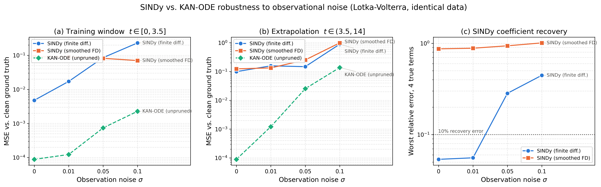
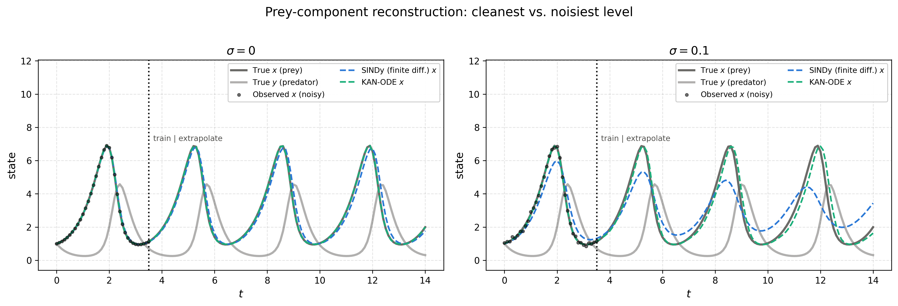
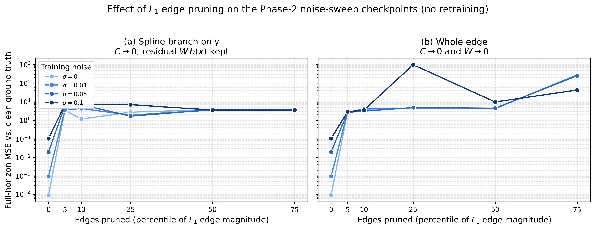

# 🧬 Track E: SINDy Comparison + Real Epidemic Fit

> **Owner:** Monjur Hossain Khan ("Shovon") — **2105043**
> **Branch:** `feat/p3-sindy-epidemic` · **Plan:** [`12`](./12_phase3_roadmap.md) §Track E (Novelty 4 + narrowed Novelty 6)
> **Code:** [`implementation/experiments/sindy_epidemic/`](../implementation/experiments/sindy_epidemic/) · **Results:** [`implementation/results/phase3/sindy_epidemic/`](../implementation/results/phase3/sindy_epidemic/)
> **Tests:** `tests/test_p3_sindy_epidemic.py` (27, no training required)
> **Reproduce:** `cd implementation/experiments/sindy_epidemic && python run_all.py`

---

## 🔭 What this track asked

Two questions, bundled because both compare a learned model against an
**independent** form of ground truth:

| | Question |
| :-: | :--- |
| **E1** | SINDy fits by sparse regression against a symbolic library; KAN-ODE fits by gradient descent through a solver. They break for different reasons. Which degrades more gracefully under observational noise — and are KAN's edges sparse enough to compare term-by-term at all? |
| **E2** | [`10`](./10_sir_root_cause_and_fix.md) rescued SIR with fixes derived from the SIR *generator's* own structure. Do they transfer to outbreak data no compartmental ODE produced? |

**Three headline findings, up front:**

1. **KAN-ODE is more accurate than SINDy at every noise level, but SINDy is far more *robust*.** KAN's extrapolation advantage collapses from $1110\times$ at $\sigma=0$ to $6.5\times$ at $\sigma=0.1$.
2. **The term-by-term symbolic comparison the blueprint asked for is not available — and now there is a number for why.** Removing the 2 weakest of 40 edges degrades the model by $3.9\times10^{4}$, to *worse than a constant predictor*. These KANs have no prunable structure, because nothing ever asked them for any.
3. **Of SIR's three fixes, only `--time_scale` transfers.** The other two are inapplicable *by measurement*, not by opinion — and both were run as control arms to prove it.

---

# Part 1 — E1: SINDy vs. KAN-ODE under noise

## 1.1 Protocol — what makes this apples-to-apples

Both methods see the **same data**. The Lotka-Volterra generator, horizon, split,
seed and noise draw are read out of each Phase-2 checkpoint's own `config` rather
than restated, so the trajectory SINDy fits is bit-identical to the one the KAN at
that $\sigma$ trained on. Both are scored the same three ways `train.py` scores
everything, **against the clean ground truth** — noise corrupts the observations,
never the target.

The KAN side is the existing `results/benchmarks/noise/sigma*` checkpoints
**re-integrated, never retrained**. That rebuild is the failure mode
[`10`](./10_sir_root_cause_and_fix.md) §Part 5 catalogues, so it is pinned by test:
re-integration reproduces all four runs' *published* `metrics.json` numbers to a
relative $10^{-4}$.

| Setting | Value |
| :--- | :--- |
| SINDy library | `PolynomialLibrary(degree=2)` — contains $x$, $y$, $x^2$, $xy$, $y^2$, $1$ |
| SINDy optimizer | `STLSQ(threshold=0.05)`, **held fixed across $\sigma$** so the sweep measures noise sensitivity, not per-level tuning |
| Differentiation | two arms: plain `FiniteDifference` and `SmoothedFiniteDifference` |
| Training window | $t \in [0, 3.5]$, 36 points, $\Delta t = 0.1$ |
| Ground truth | $\dot x = 1.5x - xy$, $\dot y = xy - 3y$ |

## 1.2 Result — accuracy vs. robustness pull in opposite directions

MSE against clean ground truth, best-epoch KAN checkpoint, SINDy fit on the same window:

| $\sigma$ | SINDy (FD) train | SINDy (FD) extrap | KAN train | KAN extrap | **KAN advantage (extrap)** |
| :-: | :-: | :-: | :-: | :-: | :-: |
| $0.00$ | $4.78\times10^{-3}$ | $9.90\times10^{-2}$ | $\mathbf{8.83\times10^{-5}}$ | $\mathbf{8.92\times10^{-5}}$ | $\mathbf{1110\times}$ |
| $0.01$ | $1.72\times10^{-2}$ | $1.58\times10^{-1}$ | $1.23\times10^{-4}$ | $1.22\times10^{-3}$ | $130\times$ |
| $0.05$ | $8.56\times10^{-2}$ | $1.48\times10^{-1}$ | $7.41\times10^{-4}$ | $2.54\times10^{-2}$ | $5.8\times$ |
| $0.10$ | $2.32\times10^{-1}$ | $8.89\times10^{-1}$ | $2.28\times10^{-3}$ | $1.37\times10^{-1}$ | $6.5\times$ |

**Degradation from $\sigma=0$ to $\sigma=0.1$:**

| Method | train | extrap |
| :--- | :-: | :-: |
| SINDy (FD) | $48.5\times$ | $\mathbf{9.0\times}$ |
| KAN-ODE | $25.8\times$ | $1540\times$ |

> **The finding.** KAN-ODE wins on absolute accuracy at every noise level tested,
> but the *margin* collapses by $170\times$ across the sweep. SINDy's extrapolation
> error is nearly noise-independent ($9\times$ over a $\sigma$ range that costs the
> KAN three orders of magnitude) because its sparse prior caps how badly noise can
> corrupt it: with only six candidate terms and a hard sparsity threshold, there is
> very little for noise to move. The KAN's 240 free parameters have no such ceiling
> — they fit the noise, and the error compounds through the solver over the
> extrapolation horizon.
>
> **Caveat.** Four noise levels, one seed, one system. The *ordering* (KAN better
> absolutely, SINDy better relatively) is consistent across all four levels, but the
> crossover $\sigma$ where SINDy would overtake is beyond the sweep and is not
> estimated here. Multi-seed replication is Phase 4 Task 4.1.

## 1.3 The two methods fail in visibly different ways

At $\sigma=0$ both track the truth for all four periods. At $\sigma=0.1$ they part company:

- **SINDy loses amplitude.** Its peaks fall from $6.9$ to about $4.5$ while the period
  stays roughly right — noisy derivative estimates bias the recovered linear
  coefficients, which sets the orbit's amplitude.
- **KAN-ODE keeps amplitude and loses phase.** Its peaks stay near $6.9$ but drift
  progressively later, which is why its extrapolation MSE explodes while its
  training MSE stays at $2.3\times10^{-3}$.

This also explains a number that looks odd in isolation: SINDy's full-horizon MSE is
$7.5\times10^{-2}$ **even at $\sigma=0$**, despite recovering every coefficient to
within $5.4\%$. Lotka-Volterra is a conservative oscillator with period $3.33$, so the
$14$-unit horizon is $4.2$ periods; a few percent of frequency error integrates into a
visible phase offset by the fourth peak. Small coefficient error, large trajectory MSE.

## 1.4 SINDy recovers the cross-term *best* — the term a KAN layer cannot represent

Per-term relative error, `FiniteDifference` arm:

| $\sigma$ | $x$ (=$\alpha$) | $xy$ (=$\beta$) | $y$ (=$\gamma$) | $xy$ (=$\delta$) | spurious terms |
| :-: | :-: | :-: | :-: | :-: | :-: |
| $0.00$ | $2.0\%$ | $2.0\%$ | $5.3\%$ | $5.4\%$ | 2 |
| $0.01$ | $5.6\%$ | $5.3\%$ | $4.9\%$ | $4.9\%$ | 4 |
| $0.05$ | $28.3\%$ | $\mathbf{5.2\%}$ | $11.9\%$ | $\mathbf{3.7\%}$ | 8 |
| $0.10$ | $\mathbf{44.6\%}$ | $\mathbf{5.7\%}$ | $2.9\%$ | $\mathbf{3.1\%}$ | 7 |

**The bilinear cross-terms are recovered to within $5.7\%$ at every noise level,
including the worst.** What degrades is the *linear* coefficient $\alpha$ — from
$2.0\%$ to $44.6\%$. SINDy's breakdown at $\sigma \ge 0.05$ is therefore not a
failure to find the interaction structure; it is a failure to pin the linear rates,
compounded by spurious terms rising from 2 to 7–8 as noise pushes marginal
coefficients past the fixed STLSQ threshold.

That matters for the comparison the blueprint framed, because $xy$ is exactly the
term a KAN cannot write down:

> A `KDense` edge is strictly **univariate** — edge $i \to o$ sees the scalar $x_i$
> and nothing else, and a layer sums its edges additively. A single layer computes
> $\sum_i \phi_{o,i}(x_i)$, which is a sum of one-variable functions and therefore
> **cannot represent $\beta x y$ at all**. The $[2,10,2]$ network only reaches it by
> composition through the hidden layer, where the interaction is smeared across 20
> edges with no one of them meaning "$xy$". SINDy's library contains $x\,y$ as a
> literal column and solves for its coefficient directly.

So the two methods are not merely differently accurate — they have different
*expressible sets*, and the term SINDy handles most robustly is the one KAN handles
least directly. A term-by-term equivalence claim between them would be comparing a
coefficient against a distributed representation. This is why §1.2's headline metric
is trajectory reconstruction, and why coefficient recovery is reported for SINDy
alone: **there is no KAN-side quantity it could be compared against.**

### A note on `SmoothedFiniteDifference` — SINDy's own noise defence backfires here

The smoothed arm is *worse than plain finite differences at every noise level*
(coefficient error $\ge 87\%$ even at $\sigma=0$). This is a property of the window,
not of the method: `SmoothedFiniteDifference` defaults to a Savitzky-Golay filter with
`window_length=11`, and at $\Delta t = 0.1$ that spans $1.1$ time units — **33% of
Lotka-Volterra's $3.33$ period, and 31% of the entire 36-point training series**. A
cubic fit across a third of an oscillation flattens the peak the derivative lives on.
Reported because it is a real trap for anyone reusing this comparison on a short,
fast-oscillating window, not because it reflects badly on SINDy.

## 1.5 L1 edge pruning: the utility exists now, and the answer is that there is nothing to prune

`utils/regularization.py` only ever *penalises* parameter magnitude during training;
nothing in the codebase ever zeroed a coefficient. `experiments/sindy_epidemic/pruning.py`
adds `prune_edges()`, which ranks each $(i, o)$ edge by the mean absolute value of its
$G$ spline coefficients and masks the weakest — **all $G$ together**, since zeroing a
scattered subset would only make an edge's curve lumpier rather than remove it. It
returns a masked deep copy, is an exact no-op at $0\%$, and takes an explicit
`prune_base` flag for whether the residual $W\,b(x)$ branch dies with the spline branch.

Applied to the four noise-sweep checkpoints (40 edges each, **no retraining**):

| $\sigma$ | 0% (baseline) | **5%** (2 of 40 edges) | 10% | 25% | 50% | 75% |
| :-: | :-: | :-: | :-: | :-: | :-: | :-: |
| $0.00$ | $8.90\times10^{-5}$ | $\mathbf{3.43}$ | $1.16$ | $2.70$ | $3.77$ | $3.77$ |
| $0.01$ | $9.38\times10^{-4}$ | $3.56$ | $4.30$ | $1.86$ | $3.71$ | $3.77$ |
| $0.05$ | $1.91\times10^{-2}$ | $6.04$ | $6.75$ | $1.68$ | $3.65$ | $3.67$ |
| $0.10$ | $1.03\times10^{-1}$ | $6.83$ | $7.30$ | $6.91$ | $3.53$ | $3.51$ |

*Full-horizon MSE, spline branch only. `prune_base=True` is worse still and is in the JSON.*

> **The finding.** Removing the **two weakest of forty edges** raises $\sigma{=}0$
> full-horizon MSE from $8.90\times10^{-5}$ to $3.43$ — a factor of
> $\mathbf{3.9\times10^{4}}$. For calibration, predicting the constant dataset mean
> scores $2.91$ and predicting the constant initial condition scores $4.83$. **A
> KAN-ODE with 5% of its edges removed is worse than a constant predictor.** There is
> no graceful degradation region to find; the cliff is at the first edge.

**Why, and why it is not a bug in the pruning.** Every one of these checkpoints was
trained with `act_reg = 0.0` and `entropy_reg = 0.0` — verified in all four
`metrics.json` files. **No L1 pressure was ever applied.** Nothing asked these
networks for sparsity, so nothing produced any: every edge carries part of the fit,
the magnitude ranking is close to arbitrary, and removing the smallest-magnitude edge
is barely different from removing a random one. The flat plateau at $\approx 3.5$–$3.8$
across all $\sigma$ and all pruning levels $\ge 25\%$ is the signature of that — the
model has collapsed to a broadly wrong trajectory and further pruning changes nothing.

This is the concrete, measured reason the blueprint's "SINDy terms vs. KAN's
$L_1$-pruned edges" comparison cannot be run on the Phase-2 artifacts: **there are no
prunable edges to compare.**

**What would make it runnable** (a Phase-4 suggestion, deliberately *not* done here —
the roadmap's definition of done requires pruning applied to existing checkpoints, not
retrained ones): retrain the $\sigma$ sweep with `--act_reg` and `--entropy_reg`
non-zero, which the CLI already supports, then re-run `prune_edges` unchanged. Only
then does "which edges survive" carry information worth holding up against SINDy's
term list.

---

# Part 2 — E2: fitting a non-mechanistic outbreak curve

<!-- E2_RESULTS_START -->
*(Runs in progress — this section is completed below once the arms finish.)*
<!-- E2_RESULTS_END -->

---

## 📁 Artifacts

| File | What it is |
| :--- | :--- |
| `results/phase3/sindy_epidemic/sindy_vs_kan_noise.json` | E1 table: SINDy (both arms) and KAN at every $\sigma$ and pruning level |
| `results/phase3/sindy_epidemic/sindy_vs_kan_noise.png` | Train / extrap MSE and coefficient recovery vs. $\sigma$ |
| `results/phase3/sindy_epidemic/sindy_vs_kan_trajectories.png` | Reconstruction at the cleanest and noisiest levels |
| `results/phase3/sindy_epidemic/pruning_degradation.png` | Pruning level vs. error, both `prune_base` settings |
| `results/phase3/sindy_epidemic/init_diagnostic.json` | E2's init-time numbers, measured before any training |
| `results/phase3/sindy_epidemic/real_epidemic_metrics.json` | E2 summary: diagnostic + every arm |
| `results/phase3/sindy_epidemic/epidemic_time_scale_sweep.png` | The $s$ sweep |
| `results/phase3/sindy_epidemic/real_epidemic_fit.png` | The fit, and the two failed control arms |
| `results/phase3/sindy_epidemic/epidemic_runs/<tag>/` | Per-arm metrics, history, checkpoint |
